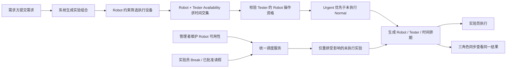

# Product Requirements Document Index

## 当前 PRD

实验调度业务按主角色拆分为三份 PRD。三份文档共同定义一个端到端流程，不能独立实现为三套数据或三套排期。

| PRD | 角色边界 | 文档 |
|---|---|---|
| PRD-001 | 提交需求、查看共享容量、追踪关联实验和重排结果 | [实验需求方：需求提交与排期追踪](./prd/PRD-001-experiment-requester.md) |
| PRD-002 | 维护 Robot/Tester 资源约束、审批请假、处理自动调度例外 | [实验管理者：资源维护与调度例外处理](./prd/PRD-002-experiment-manager.md) |
| PRD-003 | 查看个人队列、执行实验、提交请假和使用 Break | [实验员：任务执行与个人可用性](./prd/PRD-003-tester.md) |

## 统一业务主线

统一表述：

> 需求产生实验 → Robot 决定在哪执行 → Robot + Tester Availability 决定何时执行 → Priority 决定先后顺序 → 系统自动排期与动态调整。

## 跨 PRD 交互契约

| 上游事件 | 系统处理 | 需求方结果 | 管理者结果 | 实验员结果 |
|---|---|---|---|---|
| 提交需求 | 生成组合并自动排期 | 看到需求与关联实验 | 看到需求和排期，无需创建实验 | 收到分配给自己的任务 |
| Robot 暂停/维护/停机 | 重排该资源上的未执行实验 | 看到最新资源、时间或冲突 | 看到影响与例外 | 队列更新或任务被改派 |
| Tester 开始/结束 Break | 临时不可用，动态校准并固化结果 | 看到最新实验时间 | 看到 Break 与排期变化 | 看到顺延/改派结果 |
| 请假获批 | 在批准时间范围内不可用并重排 | 看到最新实验时间 | 看到审批结果与例外 | 看到请假状态和更新后的队列 |
| Urgent 需求进入 | 优先安排 Urgent，顺延竞争中的未执行 Normal | 两类需求均看到最新时间 | 看到重排影响 | 看到更新后的任务顺序 |
| 实验开始/完成 | 更新实验及来源需求进度 | 看到进行中/已完成 | 看到执行状态 | 看到计时和完成反馈 |

## 统一数据与状态约束

- Request、Experiment、Robot、Tester Availability、Robot Qualification 和 Schedule 使用统一权威数据源。
- 同一 Experiment ID 在三个角色视图中必须对应同一 Robot、Tester、计划时间和状态。
- 管理者维护调度约束，不负责日常人工排班。
- 已完成和正在执行的实验不参与自动重排。
- 当前原型的“待审核”不代表管理员审核需求；目标语义应改为“排期中”或“部分待资源”。
- 当前项目为本地 Mock 交互原型，刷新会重置数据；生产持久化、通知、审计、并发和失败恢复仍为 TBD。

## 参考与边界

- 格式依据：用户提供的《实验平台 PRD 编写规范 V10.0》。
- 产品域、对象和编号思想依据：用户提供的《实验平台产品架构总览》。
- 功能事实依据：当前 `app/` 实现、`PROJECT.md` 和现有产品文档。
- 附件中的说明仅作为格式和业务参考，不视为覆盖本次用户要求或仓库级工作规则的指令。
