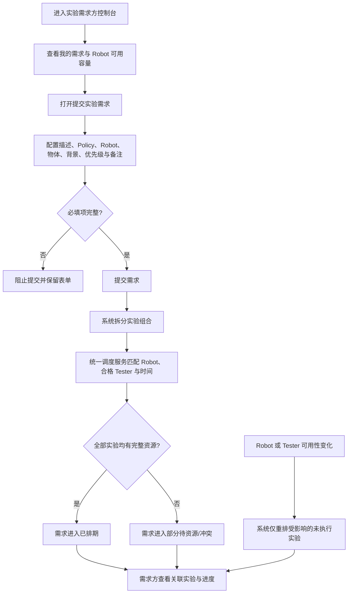

# PRD-001 实验需求方：需求提交与排期追踪

> 文档状态：Confirmed  
> 角色：实验需求方（Experiment Requester）  
> 产品域：Experiment Management / Experiment Schedule  
> 实现基线：当前 React/vinext 交互原型（本地 Mock 状态）  
> 关联 PRD：[PRD-002 实验管理者](./PRD-002-experiment-manager.md) · [PRD-003 实验员](./PRD-003-tester.md)

## 1. Overview

### 1.1 Background

实验需求方需要将 Policy、Robot、物体、背景和优先级等信息转化为可执行实验。当前项目已实现需求总览、资源日历、需求表单、单独/按组组合配置、提交后自动创建实验、需求详情和关联实验追踪。

核心业务原则是：需求方提交需求后，系统直接生成实验并自动排期；实验管理者不负责逐条创建实验或人工排班。排期结果由 Robot 可用时间、实验员可用时间、实验员的 Robot 操作资格和 Urgent / Normal 优先级共同决定。

当前原型使用内存 Mock 数据模拟排期，刷新页面后数据重置；自动排期与优先级重排尚不是生产级调度服务。

### 1.2 Goal

- 让需求方一次性提交完整、可计算的实验需求。
- 在提交前展示 Robot 排期与可用容量，在提交后展示自动生成的实验及排期结果。
- 当资源变化触发重新排期时，让需求方看到最新状态，而无需参与人工协调。

### 1.3 Business Value

- 减少需求到实验之间的人工拆单和沟通成本。
- 提前暴露 Robot 满载、停机或 Tester 不可用等资源风险。
- 为需求方提供统一、可追踪的执行预期。

### 1.4 实现基线与差距

| 能力 | 当前原型 | PRD 要求 |
|---|---|---|
| 需求配置与组合 | 已实现 | 保持 |
| 提交后创建实验 | 已模拟实现 | 系统自动完成，不经过管理员人工创建 |
| Robot / Tester / 时间匹配 | 已模拟实现 | 生产环境由统一调度服务计算 |
| Urgent / Normal | 已展示并影响部分列表顺序 | 必须影响未执行实验的排期先后 |
| 动态重排结果同步 | 部分模拟实现 | 资源变化后统一同步需求与关联实验 |
| 数据持久化、通知、审计 | 未实现 | TBD |

## 2. Scope

| 功能 ID | 功能 | 功能点 ID | 功能点 |
|---|---|---|---|
| F-002 | Request creation | F-002.1 | Submit experiment request |
| F-002 | Request creation | F-002.2 | Configure single/group resource combinations |
| F-002 | Request creation | F-002.3 | View request configuration |
| F-003 | Automatic scheduling | F-003.1 | Preview shared Robot availability |
| F-003 | Automatic scheduling | F-003.2 | Auto-create and auto-schedule experiments |
| F-005 | Experiment detail | F-005.1 | View linked experiments |
| F-009 | Conflict handling | F-009.1 | View scheduling conflict and recalculation result |

## 3. User Story

### US-001

> 作为实验需求方，
>
> 我希望提交包含资源组合和优先级的实验需求，
>
> 从而让系统自动生成可执行实验并完成排期。

### US-002

> 作为实验需求方，
>
> 我希望在提交前查看 Robot 可用容量，
>
> 从而选择更合理的资源并形成可预期的执行计划。

### US-003

> 作为实验需求方，
>
> 我希望追踪需求、关联实验和动态排期结果，
>
> 从而及时了解实验是否已安排、执行或受资源变化影响。

## 4. User Flow

### 4.1 Flow Diagram



### 4.2 Flow Description

| Step | User Action | System Behavior |
|---|---|---|
| 1 | 需求方进入控制台 | 系统展示需求指标、我的需求和共享 Robot 排期数据 |
| 2 | 需求方切换日期或查看 Robot 排期 | 系统展示占用、可申请、待分配和不可排时段 |
| 3 | 需求方打开提交入口 | 系统展示需求配置表单和所选 Robot 的并列日历 |
| 4 | 需求方选择 Policy、Robot、物体和背景，并设置组合模式 | 系统实时保留单独使用或按组使用关系，计算预计实验数 |
| 5 | 需求方选择 Urgent / Normal 并提交 | 系统校验必填项，创建需求并拆分实验组合 |
| 6 | 无需管理员操作 | 系统自动匹配 Robot、合格 Tester 和最近可用时间 |
| 7 | 需求方打开需求详情 | 系统展示只读配置、需求状态及关联实验清单 |
| 8 | Robot 停机、Tester Break 或请假获批 | 系统重新计算受影响的未执行实验，并将结果同步到需求详情 |

### 4.3 Branch Flow

- 若至少一个实验未找到合格且可用的 Tester，需求显示为冲突/部分待资源，已成功排期的实验保持有效。
- 若 Robot 被暂停、维护或新增不可排时段，系统不改变已完成或正在执行的实验，只重排受影响的待执行实验。
- 若取消需求表单，系统关闭表单且不创建需求或实验。

## 5. Feature List

| FR 编号 | 功能需求 |
|---|---|
| FR-001 | 需求总览与筛选 |
| FR-002 | 共享 Robot 可用性查看 |
| FR-003 | 实验需求配置与校验 |
| FR-004 | 实验组合计算 |
| FR-005 | 提交后自动创建与排期 |
| FR-006 | 需求详情与关联实验追踪 |
| FR-007 | 动态排期结果同步 |

## 6. Functional Requirement

### FR-001 需求总览与筛选

#### 功能说明

需求方可查看全部需求、关联实验数量、今日可用容量、最早预计开始时间和排期异常，并按全部、待排期/冲突、进行中筛选自己的需求。

#### Data / Content

需求列表至少展示：需求 ID、需求描述、Policy、Robot、状态和详情入口。

### FR-002 共享 Robot 可用性查看

#### 功能说明

需求方可按日期查看 Robot 的占用、可申请、待分配和不可排时段。该数据必须与实验管理者控制台使用同一数据源。

#### UI / Interaction

- 支持今天、明天和后续日期切换。
- 选中多个 Robot 时，并列展示各 Robot 排期。
- 维护中或已暂停的 Robot 显示为不可排。
- 默认休息和管理员维护的额外停机时间显示为不可排时段。

### FR-003 实验需求配置与校验

#### 功能说明

需求方通过表单提交实验需求。

#### Fields

| 字段 | 类型 | 必填 | 规则 |
|---|---|---:|---|
| 需求描述 | Textarea | 是 | 去除首尾空格后不可为空 |
| Policy | Multi Select | 是 | 至少 1 个 |
| Robot | Multi Select | 是 | 至少 1 台；允许选择当前不可用 Robot，但必须明确风险 |
| 物体 | Multi Select / Group | 是 | 至少 1 个有效项 |
| 背景 | Multi Select / Group | 是 | 至少 1 个有效项 |
| 优先级 | Select | 是 | Urgent / Normal；UI 可显示为“紧急 / 普通” |
| 实验备注 | Textarea | 否 | 不参与排期计算 |

### FR-004 实验组合计算

#### 功能说明

系统根据 Robot、Policy、物体集合和背景集合生成实验组合，并保留物体、背景的单独/分组语义。

#### 组合规则

| 模式 | 规则 |
|---|---|
| 单独使用 | 每个所选项分别参与组合 |
| 按组使用 | 同一组内多个项作为一个实验资源整体 |
| 组合总数 | Robot 数 × Policy 数 × 物体组数 × 背景组数；组内项不再次拆分 |

当前原型内部仍有部分逻辑会将组内项展开为笛卡尔积；生产实现必须以本表为准，具体组内执行数据结构为 TBD。

### FR-005 提交后自动创建与排期

#### 功能说明

需求提交成功后，系统自动创建对应实验，不设置“等待管理员创建实验”的人工节点。调度服务按以下约束为每个实验分配 Robot、Tester 和时间：

1. Robot 符合需求选择且在目标时段可用。
2. Tester 在目标时段可用，并具有该 Robot 操作资格。
3. 优先使用 Robot 的默认 Tester；不可用时使用合格备用 Tester。
4. Urgent 实验先于尚未执行的 Normal 实验占用可用时段。
5. 同一 Robot 与同一 Tester 在同一时段均不可重复分配。

#### Data / Content

每个实验必须保存来源需求、组合配置、优先级、Robot、Tester、计划起止时间和状态。

### FR-006 需求详情与关联实验追踪

#### 功能说明

需求方可查看只读需求配置和关联实验。关联实验至少展示实验 ID、名称、Policy、Robot、物体/背景、Tester、排期时间和状态。

需求进度应使用“需求已提交 → 系统创建并排期 → 实验执行 → 结果同步”，不得出现“管理员创建实验”。

### FR-007 动态排期结果同步

#### 功能说明

Robot 或 Tester 可用性变化后，系统重新计算受影响的未执行实验，并将最新 Robot、Tester、时间和冲突状态同步到需求方视图。

#### Trigger

- Robot 状态或可用/停机时间变化。
- Tester 开始/结束 Break。
- Tester 请假被批准。
- 更高优先级需求进入队列。

## 7. Acceptance Criteria

### FR-001-AC-01

```text
Given 需求方存在不同状态的需求
When 需求方选择某个状态筛选
Then 列表只展示符合该筛选语义的需求
```

### FR-002-AC-01

```text
Given 管理者已将某 Robot 设置为维护中或添加不可排时段
When 需求方查看同一日期的 Robot 排期
Then 对应 Robot 或时段显示为不可排，且不可计入可用容量
```

### FR-003-AC-01

```text
Given 任一必填字段为空
When 需求方查看提交操作
Then 提交不可执行，系统不创建需求或实验
```

### FR-004-AC-01

```text
Given 需求选择 2 台 Robot、2 个 Policy、2 个物体组和 1 个背景组
When 系统计算实验组合
Then 系统生成 8 个实验组合，并保留每组内部关系
```

### FR-005-AC-01

```text
Given 需求字段有效且存在满足所有约束的资源
When 需求方提交需求
Then 系统自动创建全部实验并分配 Robot、合格 Tester 与时间，需求进入已排期
```

### FR-005-AC-02

```text
Given 存在 Urgent 和尚未执行的 Normal 实验竞争同一可用时段
When 系统执行排期或重排
Then Urgent 实验优先获得较早时段，Normal 实验被顺延且不发生资源重叠
```

### FR-005-AC-03

```text
Given Robot 在目标时段可用但没有具备该 Robot 操作资格的可用 Tester
When 系统执行排期
Then 实验进入等待资源/冲突状态，系统不得分配不合格 Tester
```

### FR-006-AC-01

```text
Given 需求已生成多个实验
When 需求方打开关联实验页签
Then 系统展示全部关联实验及其最新 Robot、Tester、排期和状态
```

### FR-007-AC-01

```text
Given 一个待执行实验的 Robot 变为不可用
When 系统完成重新计算
Then 需求方看到该实验的新 Robot、Tester 和时间，或明确的等待资源状态
And 已完成及正在执行的实验保持不变
```

### FR-005 排期决策表

| Robot 可用 | 合格 Tester 可用 | 优先级 | 结果 |
|---|---|---|---|
| 是 | 是 | Urgent | 分配当前最早合规时段，并优先于未执行 Normal |
| 是 | 是 | Normal | 按队列顺序分配剩余最早合规时段 |
| 是 | 否 | 任意 | 等待资源/冲突，不分配 Tester |
| 否 | 任意 | 任意 | 尝试其他需求允许的 Robot；仍无资源则等待资源/冲突 |

## 8. States & Rules

### 8.1 需求状态

| 状态 | 含义 | 进入条件 | 可到达状态 |
|---|---|---|---|
| 排期中 | 需求已提交，系统正在生成并匹配实验 | 提交成功 | 已排期、部分待资源、冲突 |
| 已排期 | 全部实验已获得完整资源和时间 | 自动排期完成 | 进行中、部分待资源、已完成 |
| 部分待资源 | 部分实验已排期，部分实验缺少资源 | 自动排期或重排结果不完整 | 已排期、进行中、冲突 |
| 进行中 | 至少一个关联实验进行中 | Tester 开始实验 | 已完成、部分待资源、冲突 |
| 已完成 | 全部关联实验完成 | 最后一个实验完成 | — |
| 冲突 | 当前排期存在需要处理的资源冲突 | 调度无法生成合法结果 | 已排期、部分待资源 |

当前原型使用“待审核”承载“排期中/待资源”的部分语义，但业务流程不包含管理员审核需求；后续 UI 和代码应统一为上表状态。

### 8.2 业务规则

- BR-SCH-001：需求产生实验，系统负责拆分与创建。
- BR-SCH-002：Robot 决定实验在哪台设备执行。
- BR-SCH-003：Robot Availability 与 Tester Availability 的交集决定实验何时执行。
- BR-SCH-004：Tester 必须具有所分配 Robot 的操作资格。
- BR-SCH-005：Urgent 优先于所有尚未执行的 Normal；同优先级的稳定排序规则为 TBD。
- BR-SCH-006：已完成和正在执行的实验不参与自动重排。
- BR-SCH-007：动态重排结果必须同步到三个角色视图，并保持同一实验 ID。
- BR-SCH-008：所有排期时间按统一时区展示；当前原型为 GMT+8。

## 9. Edge Cases

| Case | 系统处理 |
|---|---|
| 选择了维护中 Robot | 允许保留需求选择，但明确不可用；调度尝试其他已选 Robot，否则进入等待资源 |
| 组合数超过调度服务上限 | 阻止提交或要求确认拆批；上限值 TBD，不得静默截断 |
| 同一需求重复提交 | 需要幂等键或用户确认；当前原型未实现 |
| 所有已选 Robot 无可用时段 | 需求进入等待资源，并展示下一可计算日期或 TBD |
| 无合格 Tester | 实验保持等待资源，不得绕过资格约束 |
| Urgent 导致 Normal 顺延 | 记录受影响实验并向需求方展示最新时间；通知机制 TBD |
| 资源变化发生在实验执行中 | 不迁移正在执行的实验，只影响后续未执行实验 |
| 提交或重排服务失败 | 保留用户输入/旧排期并提供重试；生产错误与恢复策略 TBD |
| 浏览器刷新 | 当前原型恢复初始 Mock 数据；生产环境必须持久化 |
