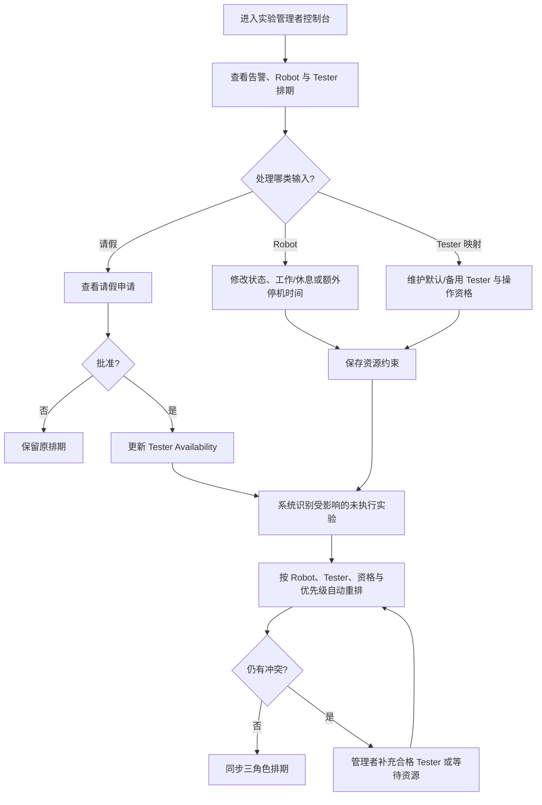

# PRD-002 实验管理者：资源维护与调度例外处理

> 文档状态：Confirmed  
> 角色：实验管理者（Experiment Manager；当前 UI 文案为“实验管理员”）  
> 产品域：Robot Management / Experiment Schedule  
> 实现基线：当前 React/vinext 交互原型（本地 Mock 状态）  
> 关联 PRD：[PRD-001 实验需求方](./PRD-001-experiment-requester.md) · [PRD-003 实验员](./PRD-003-tester.md)

## 1. Overview

### 1.1 Background

实验管理者负责维护调度系统所依赖的资源约束，而不是逐条安排班次。当前项目已实现 Robot 列表、容量与利用率、Robot 日排期、Tester 日排期、Robot 状态与不可排时段、批量工作/休息规则、默认/备用 Tester、实验详情、Tester 冲突补充和请假审批。

需求提交后，系统自动创建实验并排期。实验管理者的核心职责是保证 Robot Availability、Tester 资格映射和请假审批等输入准确，并处理自动调度无法闭环的例外。

### 1.2 Goal

- 统一维护 Robot 工作时间、停机时间、状态、容量和 Tester 资格配置。
- 审批实验员请假，并触发对未执行实验的自动重新计算。
- 通过 Robot / Tester 两个维度监控排期，只在系统无法匹配资源时处理例外。

### 1.3 Business Value

- 将管理者从手工排班转为资源治理与异常处置。
- 降低设备停机、请假和资格不匹配造成的执行冲突。
- 确保需求方、管理者和实验员看到同一份排期结果。

### 1.4 实现基线与差距

| 能力 | 当前原型 | PRD 要求 |
|---|---|---|
| Robot 列表、容量、排期 | 已实现 | 保持并接入权威数据 |
| 单机/批量可用规则 | 已模拟实现 | 保存后触发增量重排 |
| 默认/备用 Tester | 已模拟实现 | 增加明确的 Robot 操作资格模型 |
| 请假审批 | 已模拟实现 | 只影响请假覆盖时段内的未执行实验 |
| 手动指定 Tester | 已实现但未严格校验资格/可用性 | 仅作为异常处置且必须再次校验 |
| Urgent 重排影响预览、审计 | 未实现 | TBD / 待实现 |

## 2. Scope

| 功能 ID | 功能 | 功能点 ID | 功能点 |
|---|---|---|---|
| F-004 | Robot management | F-004.1 | View Robot status, capacity and utilization |
| F-004 | Robot management | F-004.2 | Maintain Robot status and blocked time |
| F-004 | Robot management | F-004.3 | Batch configure work, rest and duration rules |
| F-004 | Robot management | F-004.4 | Maintain default and backup Tester mapping |
| F-003 | Automatic scheduling | F-003.3 | View Robot and Tester schedules |
| F-005 | Experiment detail | F-005.2 | Inspect source request and experiment allocation |
| F-008 | Availability | F-008.2 | Review Tester leave |
| F-009 | Conflict handling | F-009.2 | Resolve unassigned Tester exceptions |

## 3. User Story

### US-001

> 作为实验管理者，
>
> 我希望维护 Robot 的可用和停机规则，
>
> 从而让系统基于真实设备容量自动排期。

### US-002

> 作为实验管理者，
>
> 我希望维护 Tester 的 Robot 操作资格并审批请假，
>
> 从而让系统只分配合格且可用的实验员。

### US-003

> 作为实验管理者，
>
> 我希望查看排期冲突并处理自动匹配失败的例外，
>
> 从而在不人工排班的前提下保障实验执行。

## 4. User Flow

### 4.1 Flow Diagram



### 4.2 Flow Description

| Step | User Action | System Behavior |
|---|---|---|
| 1 | 管理者进入运营页 | 系统展示今日指标、需处理事项、Robot 列表和 Robot 排期 |
| 2 | 管理者进入实验员管理 | 系统展示 Tester 排期、Break 状态和待审批请假 |
| 3 | 管理者打开 Robot 详情 | 系统展示状态、容量、每日规则、默认/备用 Tester、停机时段和今日实验 |
| 4 | 管理者保存 Robot 或 Tester 配置 | 系统更新资源约束并识别受影响的未执行实验 |
| 5 | 管理者批准请假 | 系统将覆盖时段标记为不可用，并自动匹配备用合格 Tester 或新时间 |
| 6 | 管理者拒绝请假 | 系统保留 Tester 可用性和原排期 |
| 7 | 自动重排仍缺少 Tester | 系统显示等待资源；管理者可从合格且可用名单中补充 Tester |
| 8 | 重排完成 | 系统将结果同步给需求方、管理者和相关实验员 |

### 4.3 Branch Flow

- Robot 恢复可用后，系统可将其用于新排期，但不自动回迁已合法排到其他 Robot 的实验，回迁策略 TBD。
- 批量配置只作用于明确勾选的 Robot；未选择 Robot 时不得保存。
- 管理者手动指定 Tester 只能解决匹配例外，不能直接修改时间来绕过调度约束。

## 5. Feature List

| FR 编号 | 功能需求 |
|---|---|
| FR-001 | 运营指标与异常入口 |
| FR-002 | Robot 资源列表与详情 |
| FR-003 | Robot 单机可用性维护 |
| FR-004 | Robot 批量工作规则配置 |
| FR-005 | Tester 资格与默认/备用映射 |
| FR-006 | Robot / Tester 排期监控 |
| FR-007 | 请假审批与可用性更新 |
| FR-008 | 自动重排与异常处置 |
| FR-009 | 实验与来源需求追踪 |

## 6. Functional Requirement

### FR-001 运营指标与异常入口

#### 功能说明

系统展示今日已排、Robot 可用数量、Robot 利用率、待处理实验数和待审批请假数，并提供冲突实验入口。

#### Data / Content

指标必须由当前统一排期数据计算，不使用与排期脱节的静态数字。

### FR-002 Robot 资源列表与详情

#### 功能说明

管理者可按状态筛选 Robot，并查看 Robot 状态、当前 Tester、已排/容量、利用率、当前实验和下次可用时间。点击 Robot 可查看每日规则、Tester 配置、额外不可排时段和今日实验。

### FR-003 Robot 单机可用性维护

#### Fields

| 字段 | 类型 | 必填 | 规则 |
|---|---|---:|---|
| Robot 状态 | Select | 是 | 运行中、空闲、已暂停、维护中 |
| 额外不可排开始 | Time | 条件必填 | 必须早于结束时间 |
| 额外不可排结束 | Time | 条件必填 | 必须晚于开始时间 |
| 原因 | Text | 是 | 用于排期解释和审计 |

#### 功能说明

暂停、维护或新增不可排时段后，系统降低对应容量并触发受影响实验的重排。恢复状态后，系统重新计算可用容量。

### FR-004 Robot 批量工作规则配置

#### Fields

| 字段 | 类型 | 必填 |
|---|---|---:|
| 每日工作开始/结束 | Time | 是 |
| 默认停用/休息开始/结束 | Time | 是 |
| 平均实验时长 | Select | 是 |

#### 规则

预计容量 = floor((工作跨度 − 默认停用时长) / 平均实验时长)。配置只应用到已选择 Robot；保存后系统重新计算容量与未执行实验。

### FR-005 Tester 资格与默认/备用映射

#### 功能说明

管理者为每台 Robot 维护可操作 Tester 集合，并在其中设置一个默认 Tester 和零个或多个备用 Tester。

#### 规则

- 默认/备用 Tester 必须属于该 Robot 的合格操作人员集合。
- 自动排期优先默认 Tester，再按确定性规则选择备用 Tester。
- 当前原型把“默认/备用列表”等同于资格映射；生产模型应拆分“资格”与“偏好顺序”。

### FR-006 Robot / Tester 排期监控

#### 功能说明

管理者可按 Robot 和按 Tester 查看同一日排期。Robot 视图用于检查设备容量，Tester 视图用于检查人员时间冲突。

#### UI / Interaction

- 每个时间格展示状态、实验、Policy 和另一维资源。
- 同一 Tester 同时被分配多个实验时显示冲突。
- Break、请假和 Robot 停机导致的变化必须在两个视图同步展示。

### FR-007 请假审批与可用性更新

#### 功能说明

管理者可批准或拒绝待审批请假。批准后，仅在申请时间范围内将 Tester 标记为不可用，并重排该范围内受影响的未执行实验；拒绝后不改变可用性和排期。

#### Data / Content

请假卡片展示 Tester、起止时间、原因、状态和批准/拒绝操作。

### FR-008 自动重排与异常处置

#### 功能说明

资源约束变化后，系统自动识别受影响的待执行实验，并按统一调度规则重新匹配。管理者不直接拖拽或编辑排期；只有在系统找不到合格 Tester 时，才可从系统给出的合格且可用候选人中指定。

#### 影响预览

生产版本在保存高影响配置前应展示受影响实验数量、Urgent 数量和可能顺延范围；当前原型仅提供保存后的 Toast，影响预览待实现。

### FR-009 实验与来源需求追踪

#### 功能说明

管理者可从 Robot 排期、Tester 排期、异常卡片或需求队列打开实验详情，并查看来源需求、配置、优先级、Robot、Tester 和系统排期。

## 7. Acceptance Criteria

### FR-001-AC-01

```text
Given 当前存在未匹配 Tester 或待审批请假
When 管理者打开控制台
Then 系统展示准确的待处理数量并提供对应入口
```

### FR-003-AC-01

```text
Given Robot 上存在待执行实验
When 管理者将 Robot 设置为维护中并保存
Then Robot 容量变为 0
And 系统只重排该 Robot 上受影响的未执行实验
And 已完成及正在执行的实验不变
```

### FR-003-AC-02

```text
Given 管理者新增额外不可排时段
When 结束时间不晚于开始时间
Then 系统拒绝保存并提示有效时间范围
```

### FR-004-AC-01

```text
Given 管理者未勾选任何 Robot
When 管理者尝试应用批量设置
Then 系统不保存配置并提示先选择 Robot
```

### FR-005-AC-01

```text
Given 某 Tester 不具备目标 Robot 操作资格
When 管理者尝试将其设为默认、备用或异常补充 Tester
Then 系统拒绝该配置
```

### FR-006-AC-01

```text
Given 同一 Tester 在同一时段关联两个待执行实验
When 管理者查看 Tester 排期
Then 系统显示冲突而不是将两个实验显示为合法排期
```

### FR-007-AC-01

```text
Given Tester 提交了有效请假申请
When 管理者批准申请
Then 申请状态更新为已批准
And 申请时间范围内的未执行实验自动匹配备用合格 Tester 或新时间
And 申请范围外的实验保持不变
```

### FR-007-AC-02

```text
Given Tester 提交了请假申请
When 管理者拒绝申请
Then 申请状态更新为已拒绝
And 原实验排期保持不变
```

### FR-008-AC-01

```text
Given 自动重排后仍找不到合格且可用 Tester
When 管理者打开实验详情
Then 系统显示等待资源及原因
And 只列出符合资格和时间约束的候选 Tester
```

### FR-008 重排决策表

| 变化事件 | 影响对象 | 自动处理 | 管理者动作 |
|---|---|---|---|
| Robot 暂停/维护 | 该 Robot 的未执行实验 | 尝试其他允许 Robot、Tester 和时间 | 查看结果；无资源时处理例外 |
| Robot 新增停机时段 | 与时段重叠的未执行实验 | 迁移到合法时段或 Robot | 查看结果 |
| 请假批准 | 请假覆盖的未执行实验 | 默认/备用合格 Tester → 新时间 → 等待资源 | 审批后查看例外 |
| Break 开始 | Break 后受影响的未执行实验 | 动态校准或改派 | 仅监控 |
| Urgent 进入 | 竞争时段内的未执行 Normal | Urgent 前置、Normal 顺延 | 查看影响；不手工排班 |

## 8. States & Rules

### 8.1 Robot 状态

| 状态 | 是否可被新排期使用 | 说明 |
|---|---:|---|
| 运行中 | 是（剩余可用时段） | 当前可能正在执行实验 |
| 空闲 | 是 | 可接受实验 |
| 已暂停 | 否 | 临时不可用，需管理者恢复 |
| 维护中 | 否 | 维护期内不可用 |

### 8.2 请假状态

| 状态 | 可执行动作 | 对排期影响 |
|---|---|---|
| 待审批 | 批准、拒绝 | 暂不改变正式 Availability |
| 已批准 | 查看 | 覆盖时段不可用并触发重排 |
| 已拒绝 | 查看 | 无影响 |

### 8.3 业务规则

- BR-MGR-001：管理者维护约束和审批，不负责日常人工排班。
- BR-MGR-002：任何配置保存都先形成有效资源约束，再由统一调度服务计算结果。
- BR-MGR-003：重排只作用于受影响的未执行实验。
- BR-MGR-004：手动指定 Tester 仍必须满足资格、可用性和时间不冲突。
- BR-MGR-005：已批准请假只在批准的起止时间内生效。
- BR-MGR-006：同一资源变化只能产生一个可审计的重排批次，幂等规则 TBD。
- BR-MGR-007：需求方与实验员视图不得维护独立排期副本。

## 9. Edge Cases

| Case | 系统处理 |
|---|---|
| 批量工作时段早于/等于结束时段校验失败 | 阻止保存并指出错误字段 |
| 休息时段超出工作时段 | 阻止保存 |
| 平均时长导致容量为 0 | 提示配置不可用；不得强制设为 1 |
| Robot 停机与 Urgent 实验同时发生 | 保持执行中实验；对未执行实验按 Urgent 优先重排 |
| 备用 Tester 同时 Break 或请假 | 跳过该候选人并尝试下一合格人员 |
| 请假与 Break 重叠 | 请假获批后以请假为正式不可用来源；避免重复重排 |
| 两名管理者同时审批 | 只接受第一次合法状态迁移；后续请求返回最新状态 |
| 重排服务失败 | 保留上一个合法排期，显示失败范围并允许重试；不得发布部分未知结果 |
| Robot 恢复后是否回迁实验 | 当前不自动回迁；长期策略 TBD |
| 当前原型刷新 | 恢复初始 Mock 数据；生产环境必须持久化并记录审计 |
