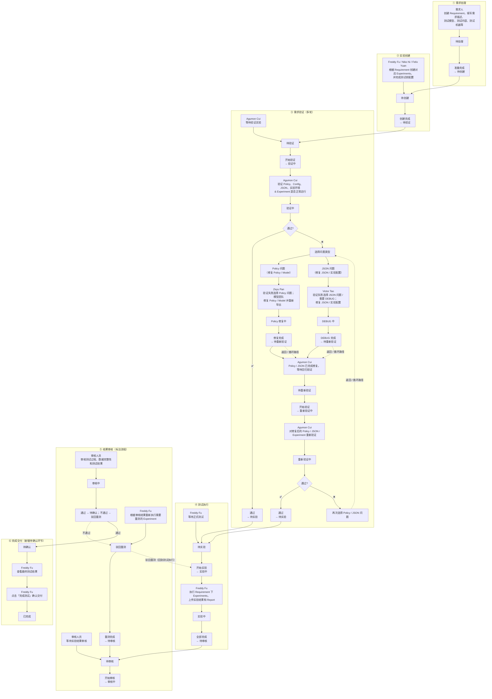
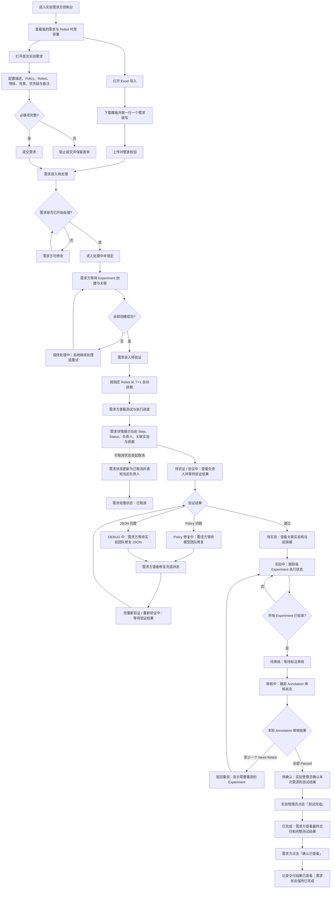

# PRD-004 实验需求方：需求提交与排期追踪

关联 PRD：[PRD-005 实验管理者](./PRD-005-experiment-manager.md) · [PRD-006 实验员](./PRD-006-tester.md)

替代：[PRD-001](../archive/2026/PRD-001-experiment-requester.md)

共享契约：[实验调度共享契约](../shared/scheduling-contract.md)

长期角色与权限来源：[Roles and Permissions](../../roles-permissions.md)

## 1. Overview

### 1.1 Background

实验需求方需要将 Policy、Robot、物体、背景和优先级等信息转化为可处理需求。当前项目已实现需求总览、资源日历、需求表单、Excel 批量导入、单独/按组组合配置、待处理阶段修改、处理后锁定、需求详情和关联实验追踪。

核心业务原则调整为：需求方提交后需求立即进入“待处理”，不直接创建实验。管理员开始处理前，需求方可修改或经二次确认删除；管理员开始后需求进入“处理中”并锁定，且不可删除。需求方可在活动阶段发起取消；当前原型标记为“已取消”并保留已有记录，需求级取消通知按 FR-009 执行，已创建 Experiment 处置和资源释放规则仍为 TBD。脚本按需求 ID 创建并关联实验，全部创建后由管理员完成验证与必要的 Policy / JSON 修复循环，验证通过后进入测试执行。

每个生成的 Experiment 继承组合中指定的 Robot，并进入该 Robot 的固定队列。排期最早从 Requirement 创建日期的次日（T+1）开始；Robot 不可用时实验在原 Robot 队列中顺延，不自动更换 Robot。

当前原型使用内存 Mock 数据模拟排期，刷新页面后数据重置；自动排期与优先级重排尚不是生产级调度服务。

#### 实验全生命周期管理总览

以下内容按业务流程原图逐项转录，保留原图中的阶段名称、具体责任人、主要操作 / 判断、状态、流转结果、通过 / 失败路径和循环路径，不对姓名或状态术语做归一化。



#### 原图信息逐项对照

| 阶段 | 责任人 | 主要操作 / 判断 | 状态 | 后续操作 / 流转结果 |
|---|---|---|---|---|
| ① 需求处理 | 需求人 | 创建 Requirement，填写需求描述、测试模型、测试内容、测试机器等 | 待处理 | 准备完成 → 待创建 |
| ② 实验创建 | Freddy Fu / Niko Ni / Felix Yuan | 根据 Requirement 创建对应 Experiments，并完成测试前配置 | 待创建 | 创建完成 → 待验证 |
| ③ 需求验证（多轮） | Agumon Cui | 等待验证实验 | 待验证 | 开始验证 → 验证中 |
| ③ 需求验证（多轮） | Agumon Cui | 验证 Policy、Config、JSON、实验环境 & Experiment 是否正常运行 | 验证中 | 判断“通过？”；通过 → 待实验；失败 → 选择问题类型 |
| ③ 需求验证（多轮） | Zeyu Pan | 验证失败选择 Policy 问题；模型团队修复 Policy / Model 并重新导出 | Policy 修复中 | 修复完成 → 待重新验证 |
| ③ 需求验证（多轮） | Victor Tao | 验证失败选择 JSON 问题 / 需要 DEBUG；修复 JSON / 实验配置 | DEBUG 中 | DEBUG 完成 → 待重新验证 |
| ③ 需求验证（多轮） | Agumon Cui | Policy / JSON 已完成修复，等待回归验证 | 待重新验证 | 开始验证 → 重新验证中 |
| ③ 需求验证（多轮） | Agumon Cui | 对修复后的 Policy / JSON / Experiment 重新验证 | 重新验证中 | 判断“通过？”；通过 → 待实验；失败 → 再次选择 Policy / JSON 问题，并返回对应修复与重新验证循环 |
| ④ 测试执行 | Freddy Fu | 等待正式测试 | 待实验 | 开始实验 → 实验中 |
| ④ 测试执行 | Freddy Fu | 执行 Requirement 下 Experiments，上传实验结果和 Report | 实验中 | 全部完成 → 待审核 |
| ⑤ 结果审核（标注流程） | 审核人员 | 等待实验结果审核 | 待审核 | 开始审核 → 审核中 |
| ⑤ 结果审核（标注流程） | 审核人员 | 审核测试过程、数据完整性和测试结果 | 审核中 | 通过 → 待确认；不通过 → 驳回重测 |
| ⑤ 结果审核（标注流程） | Freddy Fu | 根据审核结果重新执行需要重测的 Experiment | 驳回重测 | 重测完成 → 待审核；同时通过“驳回重测（回到测试执行）”路径返回“开始实验 → 实验中” |
| ⑥ 完成交付（新增待确认环节） | Freddy Fu | 查看最终测试结果 | <mark>待确认</mark> | 点击「完成测试」确认交付 |
| ⑥ 完成交付（新增待确认环节） | Freddy Fu | 点击「完成测试」确认交付 | 待确认 | <mark>已完成</mark> |

#### 问题类型与循环路径

| 触发点 | 路径类型 | 路径内容 |
|---|---|---|
| 首轮“通过？”判断为通过 | 通过路径 | 通过 → 待实验 |
| 首轮“通过？”判断为失败 | 失败路径 | 选择问题类型 → Policy 问题（修复 Policy / Model）或 JSON 问题（修复 JSON / 实验配置） |
| Policy 问题 | 返回 / 循环路径 | Policy 修复中 → 修复完成 → 待重新验证 |
| JSON 问题 | 返回 / 循环路径 | DEBUG 中 → DEBUG 完成 → 待重新验证 |
| 回归验证“通过？”判断为通过 | 通过路径 | 通过 → 待实验 |
| 回归验证“通过？”判断为失败 | 失败路径 | 再次选择 Policy / JSON 问题 → 返回对应修复流程 → 再次回归验证 |
| 审核通过并确认交付 | 通过路径 | 审核中 → 待确认 → 查看最终测试结果 → 点击「完成测试」确认交付 → 已完成 |
| 审核不通过 | 失败 / 循环路径 | 审核中 → 驳回重测 → 驳回重测（回到测试执行）→ 开始实验 → 实验中 → 重测完成 → 待审核 |

#### 图例说明

| 图例 | 含义 |
|---|---|
| 实线边框节点 | 主要操作 / 判断 |
| 虚线边框节点 | 状态 |
| 实线箭头 | 流程推进 |
| 虚线箭头 | 返回 / 循环路径 |
| ✅ | 通过路径 |
| ❌ | 失败路径 |

### 1.2 Goal

- 让需求方提交后立即获得可追踪需求。
- 允许需求方在管理员尚未开始处理的“待处理”阶段修改需求。
- 管理员开始处理后向需求方提供只读状态与关联实验结果，异常不退回需求方。

### 1.3 Business Value

- 减少需求到实验之间的人工拆单和沟通成本。
- 提前暴露 Robot 满载、停机或 Tester 不可用等资源风险。
- 为需求方提供统一、可追踪的执行预期。

### 1.4 实现基线与差距

| 能力 | 当前原型 | PRD 要求 |
|---|---|---|
| 需求配置与组合 | 已实现 | 保持 |
| 提交后创建实验 | 已改为需求处理流程 | 提交后仅进入待处理；管理员触发脚本创建 |
| Robot / Tester / 时间匹配 | 已模拟实现 | 生产环境由统一调度服务计算 |
| Urgent / Normal | 已展示并影响部分列表顺序 | 必须影响未执行实验的排期先后 |
| 动态重排结果同步 | 部分模拟实现 | 资源变化后统一同步需求与关联实验 |
| 数据持久化、通知、审计 | 未实现 | TBD |

## 2. Scope

| 功能 ID | 功能 | 功能点 ID | 功能点 |
|---|---|---|---|
| EXP-007 | Experiment Detail | EXP-007.1 | View Experiment Detail Information |
| EXP-305 | Robot Schedule View | EXP-305.1 | View Robot Schedule |
| EXP-305 | Robot Schedule View | EXP-305.2 | View Daily Experiment Records |
| EXP-305 | Robot Schedule View | EXP-305.4 | View Assigned Tester |

### 待登记功能资产（不属于正式 Scope）

| 建议归属 | 建议功能 / 功能点 | 未匹配原因 | 状态 |
|---|---|---|---|
| Experiment Management / 新业务对象 Requirement | Requirement 创建、编辑、删除、取消、列表、筛选、详情、生命周期流转与通知 | `product-structure.md` 尚未登记 Requirement 业务对象，Excel 无对应功能点 | Pending Confirmation |
| Experiment Schedule | Requirement 与 Experiment 关联、T+1 自动排期、优先级排序、顺延与重排结果查看 | Excel 仅登记排期查看能力，未登记排期计算与需求关联能力 | Pending Confirmation |
| Experiment Management / Requirement | Excel 批量导入 Requirement | Excel 无对应功能点 | Pending Confirmation |

Scope 校验说明：Excel 中 `EXP-301.*`、`EXP-302.1` 和 `EXP-302.2` 同时被 Experiment Schedule 与 Flagged Annotation 使用，存在 ID 冲突，本 PRD 不引用这些冲突项。

## 3. User Story

### US-001

> 作为实验需求方，
>
> 我希望提交包含资源组合和优先级的实验需求，
>
> 从而让管理员按明确需求创建并确认可执行实验。

### US-002

> 作为实验需求方，
>
> 我希望在提交前查看 Robot 可用容量，
>
> 从而选择更合理的资源并形成可预期的执行计划。

### US-003

> 作为实验需求方，
>
> 我希望追踪需求、关联实验和动态排期结果，
>
> 从而及时了解实验是否已安排、执行或受资源变化影响。

## 4. User Flow

### 4.1 Flow Diagram



### 4.2 Flow Description

| Step | User Action | System Behavior |
|---|---|---|
| 1 | 需求方进入控制台 | 系统展示需求指标、我的需求和共享 Robot 排期数据 |
| 2 | 需求方切换日期或查看 Robot 排期 | 系统展示占用、可申请、待分配和不可排时段 |
| 3 | 需求方打开提交入口 | 系统展示需求配置表单和所选 Robot 的并列日历 |
| 4 | 需求方选择 Policy、Robot、物体和背景，并设置组合模式 | 系统实时保留单独使用或按组使用关系，计算预计实验数 |
| 5 | 需求方选择 Urgent / Normal 并提交 | 系统校验必填项，需求进入“待处理”，不创建实验 |
| 6 | 需求仍为待处理 | 需求方从详情点击“修改需求”，系统复用提交弹窗并完整回填所有字段；保存后状态不变 |
| 7 | 需求方等待需求开始处理 | 开始处理后，需求进入“处理中”，需求方视图变为只读 |
| 8 | 需求方打开需求详情 | 系统展示需求状态及脚本回写的关联实验；异常不要求需求方处理 |
| 9 | Robot 停机、Tester Break 或请假获批 | 系统重新计算受影响的未执行实验，并将结果同步到需求详情 |
| 10 | 需求方打开 Excel 导入并下载模板 | 系统提供与当前需求表单字段和组合结构一致的 `.xlsx` 模板 |
| 11 | 需求方上传已填写模板 | 系统校验工作表、表头、必填项、目录值、模式、分组和优先级；全部通过后按一行一个 Requirement 批量创建为“待处理” |
| 12 | 需求方查看已创建 Experiment 的排期 | 系统按指定 Robot、T+1、Priority、Requirement FIFO 和 Experiment 创建顺序展示结果；容量不足时顺延 |
| 13 | 需求方在需求详情查看测试与执行进度 | 系统展示固定 Stepper、当前内部 Status、当前负责人、关联 Experiment 和最新排期；列表中的需求处理状态继续使用聚合状态 |
| 14 | 需求方查看“待验证”或“验证中”的需求 | 系统展示当前负责人和验证进度；需求方等待验证结果 |
| 15 | 需求方查看“Policy 修复中”的需求 | 系统展示当前负责人和 Policy 修复状态；需求方等待模型团队完成修复 |
| 16 | 需求方查看“DEBUG 中”的需求 | 系统展示当前负责人和 DEBUG 状态；需求方等待实验团队完成 JSON / 实验配置修复 |
| 17 | 需求方查看“待重新验证”或“重新验证中”的需求 | 系统展示 Policy 或 JSON 已修复以及当前回归验证进度；验证失败时再次进入对应修复状态，验证通过时进入“待实验” |
| 18 | 需求方查看“待实验”的需求 | 系统展示关联 Experiment 和当前排期；所有关联 Experiment 均为 Created / Assigned，即没有任何实验开始过 |
| 19 | 需求方查看“实验中”的需求 | 系统展示各 Experiment 的执行状态；至少 1 个 Experiment 为 Running / Completed / Aborted，且仍存在未结束的 Experiment（Created / Assigned / Running） |
| 20 | 需求方持续跟踪实验进度 | 若仍存在未结束的 Experiment，需求保持“实验中”；所有 Experiment 均结束执行后，需求进入“待审核” |
| 21 | 需求方查看“待审核”的需求 | 系统展示需求已进入结果审核（标注流程）；所有 Experiment 均为 Completed / Aborted，至少 1 个 Annotation = Needs Review，且不存在 Annotation = In Progress |
| 22 | 需求方查看“审核中”的需求 | 系统展示当前审核进度；所有 Experiment 均已结束执行，且至少存在 1 个 Annotation = In Progress |
| 23 | 需求方查看“驳回重测”的需求 | 系统明确展示需要重测的 Experiment；所有 Annotation 均已完成审核，不存在 Needs Review / In Progress，且至少存在 1 个 Annotation = Need Retest |
| 24 | 需求方等待被驳回的 Experiment 重测 | 重测开始后需求重新进入“实验中”；重测完成后再次进入“待审核”，继续结果审核流程 |
| 25 | 需求方查看“待确认”的需求 | 当本轮所有需要审核的 Annotation 均为 Passed，且不存在 Need Retest / Needs Review / In Progress 时，系统进入“完成交付 / 待确认”；当前负责人为实验管理员 Freddy Fu，需求方等待管理员确认本次需求的测试结果 |
| 26 | 实验管理员在“待确认”状态确认测试结果并点击“测试完成” | 系统将需求更新为“已完成”，结束需求生命周期，并向需求方展示最终交付和完整测试结果 |
| 27 | 需求方查看“已完成”的需求并点击“确认已查看” | 系统记录交付结果已被需求方查看；该操作不改变 Requirement 状态，需求继续保持“已完成” |
| 28 | 需求方在允许取消的状态点击“取消需求” | 系统将需求处理状态更新为“已取消”，并通知当前负责人需求已取消 |

### 4.3 Branch Flow

- 若创建或关联未全部成功，需求保持“处理中”，需求方只读查看；管理员侧展示异常并重试。
- 若 Robot 被暂停、维护或新增不可排时段，系统不改变已完成或正在执行的实验，只重排受影响的待执行实验。
- 若取消需求表单，系统关闭表单且不创建需求或实验。
- 需求方可在任何阶段发起取消；系统将需求处理状态更新为“已取消”，按 FR-009 通知取消前的当前负责人并同步飞书群；已创建或执行中 Experiment 的处置和资源释放规则仍为 TBD。
- 待处理需求可经二次确认删除；管理员开始处理后不允许删除。

## 5. Feature List

| FR 编号 | 功能需求 | 描述 |
|---|---|---|
| FR-001 | 需求总览与筛选 | 查看需求概览、需求列表，并按需求处理状态筛选自己的需求。 |
| FR-002 | 共享 Robot 可用性查看 | 按日期查看 Robot 的占用、可申请、待分配和不可排时段，并与实验管理员使用同一排期数据。 |
| FR-003 | 实验需求配置与校验 | 配置需求描述、Policy、Robot、物体、背景、优先级、扩展字段、实验备注和通知推送，并校验必填项及资源确认提示。 |
| FR-004 | 实验组合计算 | 根据 Robot、Policy、物体和背景的单独/分组关系计算实验组合数量，并保留组内资源关系。 |
| FR-005 | 需求提交、修改、取消/删除、锁定与实验回写 | 提交需求进入待处理；支持管理员处理前修改或删除、活动阶段取消、处理后锁定，以及 Experiment 创建与来源关联回写。 |
| FR-006 | 需求详情与关联实验追踪 | 查看需求配置、当前流程阶段与状态、负责人、关联实验、排期及执行状态。 |
| FR-007 | 动态排期结果同步 | Robot 或 Tester 可用性及优先级变化后，重新计算受影响的未执行实验，并同步最新 Tester、时间和冲突状态。 |
| FR-008 | Excel 批量创建实验需求 | 通过 Excel 模板批量导入并创建实验需求，统一校验后进入待处理。 |
| FR-009 | 流程流转与通知 | 按 Requirement 生命周期推进聚合状态、详情 Stepper 和关联实验流程，并在取消、验证与修复、排期变化、审核驳回、待确认及完成交付等关键节点通知当前负责人和相关角色。 |

## 6. Functional Requirement

### FR-001 需求总览与筛选

#### 功能说明

需求方可查看全部需求、关联实验数量、今日可用容量和需求处理状态，并按“全部、待处理、处理中、实验中、<mark>待确认</mark>、已完成”筛选自己的需求。

#### Data / Content

- **需求处理状态**是需求列表使用的聚合状态。

#### Requirement Status 映射

| 需求处理状态 | 状态说明 | 对应需求详情 Stepper 阶段 | 包含的内部阶段 / 状态 |
|---|---|---|---|
| 待处理 | 需求已经提交，但还没有正式进入验证和测试流程 | ① 需求处理 / ② 实验创建 | 待处理、待创建 |
| 处理中 | 实验已经创建，正在进行测试前的准备、验证或问题处理 | ③ 需求验证 | 待验证、验证中、Policy 修复中、DEBUG 中、待重新验证、重新验证中 |
| 实验中 | 需求已经通过前置验证，进入正式测试及测试结果处理阶段 | ④ 测试执行 / ⑤ 结果审核 | 待实验、实验中、待审核、审核中、驳回重测 |
| <mark>待确认</mark> | <mark>本轮测试与审核已经全部通过，等待实验需求管理员确认完成交付</mark> | <mark>⑥ 完成交付</mark> | <mark>待确认</mark> |
| <mark>已完成</mark> | <mark>实验需求管理员已确认本次需求的测试结果，Requirement 生命周期已经完成</mark> | <mark>⑥ 完成交付</mark> | <mark>已完成</mark> |
| 已取消 | 需求取消 | 需求取消 | 需求取消 |

#### 需求详情 Stepper

- **需求详情中 Stepper** 用于需求详情展示更细的业务流程，具体内部状态决定当前步骤条停留在哪一个阶段。

| Step | 流程阶段 | 状态 | 当前负责人 | 主要操作 / 判断 | 完成后流转 |
|---|---|---|---|---|---|
| ① | 需求处理 | 待处理 | Freddy Fu / Niko Ni / Felix Yuan | 创建 Requirement，填写需求描述、测试模型、测试内容、测试机器等 | 准备完成 → 待创建 |
| ② | 实验创建 | 待创建 | Freddy Fu / Niko Ni / Felix Yuan | 根据 Requirement 创建对应 Experiments，并完成测试前配置 | 创建完成 → 待验证 |
| ③ | 需求验证 | 待验证 | Agumon Cui | 等待验证实验 | 开始验证 → 验证中 |
| ③ | 需求验证 | 验证中 | Agumon Cui | 验证 Policy、Config、JSON、实验环境及 Experiment 是否正常运行 | 通过 → 待实验；失败 → 选择问题类型 |
| ③A | 需求验证 | Policy 修复中 | Zeyu Pan | 验证失败选择 **Policy 问题**；模型团队修复 Policy / Model 并重新导出 | 修复完成 → 待重新验证 |
| ③B | 需求验证 | DEBUG 中 | Victor Tao | 验证失败选择 **JSON 问题 / 需要 DEBUG**；修复 JSON / 实验配置 | DEBUG 完成 → 待重新验证 |
| ③ | 需求验证 | 待重新验证 | Agumon Cui | Policy / JSON 已完成修复，等待回归验证 | 开始验证 → 重新验证中 |
| ③ | 需求验证 | 重新验证中 | Agumon Cui | 对修复后的 Policy / JSON / Experiment 重新验证 | 通过 → 待实验；失败 → 再次选择 Policy / JSON 问题 |
| ④ | 测试执行 | 待实验 | 实验测试员 | 等待正式测试 | 开始实验 → 实验中 |
| ④ | 测试执行 | 实验中 | 实验测试员 | 执行 Requirement 下 Experiments，上传实验结果和 Report | 全部完成 → 待审核 |
| ⑤ | 结果审核（标注流程） | 待审核 | 实验测试员 | 等待实验结果审核 | 开始审核 → 审核中 |
| ⑤ | 结果审核（标注流程） | 审核中 | 实验测试员 | 审核测试过程、数据完整性和测试结果 | 通过 → 待确认；不通过 → 驳回重测 |
| ⑤ | 结果审核（标注流程） | 驳回重测 | Freddy Fu | 根据审核结果重新执行需要重测的 Experiment | 重测完成 → 待审核 |
| ⑥ | 完成交付 | 待确认 | Freddy Fu | 查看最终测试结果并确认本次需求的交付 | 点击「测试完成」→ 已完成 |
| ⑥ | 完成交付 | 已完成 | 需求人 | 查看最终交付并可点击「确认已查看」 | 流程结束；「确认已查看」只记录查看结果，不改变状态 |

#### 实验需求方流程

| Step | 当前状态 | 需求方当前任务 | 主 CTA | 副 CTA | 说明 | 状态特别说明 | CTA 后预期效果 |
|---|---|---|---|---|---|---|---|
| ① 需求处理 | 待处理 | 完善需求信息 | 修改需求 | 删除需求 | 提交需求 → 待创建，进入实验管理员处理队列 | — | 修改需求：编辑需求<br/>删除需求：删除需求不可恢复 |
| ② 实验创建 | 待创建 | 等待管理员创建 Experiment | 取消需求 | — | 需求方以查看为主 | — | 取消需求：通知当前负责人需求已取消 |
| ③ 需求验证 | 待验证 | 等待验证 | 取消需求 | — | 显示当前负责人 | — | 取消需求：通知当前负责人需求已取消 |
| ③ 需求验证 | 验证中 | 等待验证结果 | 取消需求 | — | 验证通过进入测试；失败进入对应问题处理 | — | 取消需求：通知当前负责人需求已取消 |
| ③ 需求验证 | Policy 修复中 | 等待模型团队完成 Policy 修复 | 取消需求 | — | 等待 Policy 更新 | — | 取消需求：通知当前负责人需求已取消 |
| ③ 需求验证 | DEBUG 中 | 等待实验团队修复 JSON | 取消需求 | — | 等待 DEBUG | — | 取消需求：通知当前负责人需求已取消 |
| ③ 需求验证 | 待重新验证 | 等待负责人回归验证 | 取消需求 | — | 显示 Policy 或 JSON 已修复，等待重新验证 | — | 取消需求：通知当前负责人需求已取消 |
| ③ 需求验证 | 重新验证中 | 等待验证结果 | 取消需求 | — | 验证通过进入待实验；失败再次进入 Policy / DEBUG 修复 | — | 取消需求：通知当前负责人需求已取消 |
| ④ 测试执行 | 待实验 | 等待测试 | 取消需求 | — | 可以查看关联实验和当前排期 | 所有关联 Experiment 均为 Created / Assigned，即没有任何实验开始过 | 取消需求：通知当前负责人需求已取消 |
| ④ 测试执行 | 实验中 | 跟踪测试进度 | 取消需求 | — | 可以查看各实验执行状态 | 至少 1 个 Experiment 为 Running / Completed / Aborted，且仍存在未结束的 Experiment（Created / Assigned / Running） | 取消需求：通知当前负责人需求已取消 |
| ⑤ 结果审核（标注流程） | 待审核 | 等待标注审核 | 取消需求 | — | 可以看到当前处于审核阶段（标注流程） | 所有 Experiment 均已结束执行（Completed / Aborted），且至少存在 1 个 Annotation = Needs Review，同时不存在 In Progress | — |
| ⑤ 结果审核（标注流程） | 审核中 | 标注审核中 | 取消需求 | — | 可以看到当前处于审核阶段（标注流程） | 所有 Experiment 均已结束执行，且至少存在 1 个 Annotation = In Progress | 取消需求：通知当前负责人需求已取消 |
| ⑤ 结果审核 | 驳回重测 | 等待重测 | — | — | 明确显示哪些实验被驳回重测 | 所有 Annotation 均已完成审核（不存在 Needs Review / In Progress），且至少存在 1 个 Annotation = Need Retest | — |
| ⑥ 完成交付 | 待确认 | 等待交付确认 | — | — | 本轮测试与审核已通过，等待完成交付确认 | 本轮所有需要审核的 Annotation 均 = Passed，不存在 Need Retest / Needs Review / In Progress | — |
| ⑥ 完成交付 | 已完成 | 查看最终交付 | 确认已查看 | — | 需求生命周期结束，可查看完整测试结果 | 本轮所有需要审核的 Annotation 均 = Passed，不存在 Need Retest / Needs Review / In Progress | 需求方可对已完成需求执行「确认已查看」，该操作仅用于记录交付结果已被需求方查看 |

#### 实验管理员方流程

| Step | 当前状态 | 当前负责人 | 主 CTA | 副 CTA | 说明 | 状态特别说明 | CTA 后预期效果 |
|---|---|---|---|---|---|---|---|
| ① 需求处理 | 待处理 | Freddy Fu / Niko Ni / Felix Yuan | 开始处理 | 取消 | 管理员等待需求正式提交 | — | 需求更新为实验创建流程，状态为待创建 |
| ② 实验创建 | 待创建 | Freddy Fu / Niko Ni / Felix Yuan | 关联创建实验 | 取消 | 根据 Requirement 创建 Experiment | — | 成功：显示关联实验<br/>失败：提示关联失败，请重试 |
| ③ 需求验证 | 待验证 | Agumon Cui | 开始验证 | 取消 | Requirement → 验证中 | — | — |
| ③ 需求验证 | 验证中 | Agumon Cui | 通过 | 不通过 | 通过 → 待实验；不通过 → 弹出问题类型选择 | — | 验证通过：需求进入测试执行 |
| ③ 需求验证（弹窗） | 验证不通过 | Agumon Cui | 确认 | 取消 | 必须选择 **Policy 问题 / JSON 问题**；提供可选填输入文本区域 | — | — |
| ③A 需求验证 | Policy 修复中 | Agumon Cui | Policy修复完成 | 取消 | 显示文本内容<br/>更新 Policy → 待重新验证 | — | — |
| ③B 需求验证 | DEBUG 中 | Zeyu Pan | Debug完成 | 取消 | 显示文本内容<br/>更新 JSON → 待重新验证 | — | — |
| ③ 需求验证 | 待重新验证 | Victor Tao | 开始验证 | 取消 | 需求重新验证中 | — | — |
| ③ 需求验证 | 重新验证中 | Agumon Cui | 通过 | 不通过 | 通过 → 待实验；失败 → 再次选择 Policy / JSON 问题 | — | — |
| ④ 测试执行 | 待实验 | Agumon Cui | — | — | 可以查看关联实验和当前排期 | 所有关联 Experiment 均为 Created / Assigned，即没有任何实验开始过 | — |
| ④ 测试执行 | 实验中 | 实验测试员 | — | — | 可以查看各实验执行状态 | 至少 1 个 Experiment 为 Running / Completed / Aborted，且仍存在未结束的 Experiment（Created / Assigned / Running） | — |
| ⑤ 结果审核 | 待审核 | 实验测试员 | — | — | 可以看到当前处于审核阶段（标注流程） | 所有 Experiment 均已结束执行（Completed / Aborted），且至少存在 1 个 Annotation = Needs Review，同时不存在 In Progress | — |
| ⑤ 结果审核 | 审核中 | 实验测试员 | — | — | 可以看到当前处于审核阶段（标注流程） | 所有 Experiment 均已结束执行，且至少存在 1 个 Annotation = In Progress | — |
| ⑤ 结果审核 | 驳回重测 | 实验测试员 | — | — | 明确显示哪些实验被驳回重测 | 所有 Annotation 均已完成审核（不存在 Needs Review / In Progress），且至少存在 1 个 Annotation = Need Retest | — |
| ⑥ 完成交付 | 待确认 | Freddy Fu | 测试完成 | 取消 | 确认本次需求的测试结果 | 本轮所有需要审核的 Annotation 均 = Passed，不存在 Need Retest / Needs Review / In Progress | — |
| ⑥ 完成交付 | 已完成 | — | — | — | 需求生命周期结束，可查看完整测试结果 | 本轮所有需要审核的 Annotation 均 = Passed，不存在 Need Retest / Needs Review / In Progress | — |

#### Edge Case

| 需求处理状态 | Edge Case | 场景说明 | 系统处理 |
|---|---|---|---|
| 全流程 | 取消需求 | 任何阶段 | 需求方可发起取消 |
| 全流程 | 删除待处理需求 | 需求已提交，但管理员尚未开始处理 | 需求方可以删除。删除前二次确认；确认后需求不再进入后续处理流程 |
| 全流程 | 删除处理中需求 | 管理员已经开始处理，可能已经创建或正在创建 Experiment | 不允许需求方直接删除，避免影响已创建 Experiment 及关联关系 |
| 全流程 | 删除测试中需求 | 已进入测试执行或结果审核 | 不允许删除，保留 Requirement 与 Experiment 的完整执行记录 |
| ③ 需求验证 | Policy 修复中 | 实验验证过程中发现 Policy 存在问题，需要由模型团队修复模型 | 需求保持在 ③ 需求验证；模型团队修复后通过 API 更新原 Experiment，更新成功后进入待重新验证 |
| ③ 需求验证 | DEBUG 中 | 实验验证过程中发现实验配置 JSON 存在问题，需要由实验团队修复 JSON | 需求保持在 ③ 需求验证；实验团队修复后通过 API 更新原 Experiment，更新成功后进入待重新验证 |
| ③ 需求验证 | 重新验证失败 | Policy 或 JSON 修复后仍无法通过验证 | 需求继续停留在 ③ 需求验证阶段，并再次进入对应修复流程，不回退到「② 实验创建」 |
| ③ 需求验证 | 重新验证通过 | Policy 或 JSON 修复完成，且实验重新验证通过 | 原 Experiment 继续向 ④ 测试执行 流转，不产生新的 Experiment |

### FR-002 共享 Robot 可用性查看

#### 功能说明

需求方可按日期查看 Robot 的占用、可申请、待分配和不可排时段。该数据必须与实验管理者控制台使用同一数据源。

#### UI / Interaction

- 支持今天、明天和后续日期切换。
- 选中多个 Robot 时，并列展示各 Robot 排期。
- 维护中或已暂停的 Robot 显示为不可排。
- 默认休息和管理员维护的额外停机时间显示为不可排时段。

#### Robot 实验排期规则

需求配置中的每个 Robot 组合生成对应 Experiment；Experiment 创建后直接进入该指定 Robot 的队列，Robot 归属不因后续不可用而自动改变。

| 排期规则 | 说明 |
|---|---|
| T+1 排期 | 最早从 Requirement 创建日期的次日开始排期 |
| 一级排序 | Urgent 优先于 Normal |
| 二级排序 | 同优先级按 Requirement 创建时间 FIFO，先创建先排 |
| 三级排序 | 同一 Requirement 下的 Experiment 按创建顺序依次排期 |
| 自动顺延 | 当日容量不足时，剩余 Experiment 顺延到该 Robot 的下一可用日期 |
| 紧急插队 | 新增 Urgent 时，只重排尚未开始的 Experiment；不影响正在执行或已完成的 Experiment |
| Robot 不可用 | Experiment 保留在指定 Robot 队列并向后顺延，不自动更换 Robot |

### FR-003 实验需求配置与校验

#### 功能说明

需求方通过同一表单提交或修改实验需求。修改入口只在“待处理”状态可用；修改时必须回填需求描述、Policy、Robot、物体、背景、物体/背景使用方式、优先级和实验备注，所有字段均可重新编辑。

- 当需求涉及资源库中不存在的物体或背景时，需求方需先线下与实验管理员确认资源可用性及相关配置，确认后方可提交需求。
  - 选择物体和背景区域顶部展示提示文案：“若所需物体或背景不在资源库中，请先联系实验管理员确认后再提交需求。”

#### Fields

| 字段 | 类型 | 必填 | 规则 |
|---|---|---:|---|
| 需求描述 | Textarea | 是 | 去除首尾空格后不可为空 |
| Policy | Multi Select | 是 | 至少 1 个 |
| Robot | Multi Select | 是 | 至少 1 台；允许选择当前不可用 Robot，但必须明确风险 |
| 物体 | Multi Select / Group | 是 | 至少 1 个有效项 |
| 背景 | Multi Select / Group | 是 | 至少 1 个有效项 |
| 优先级 | Select | 是 | Urgent / Normal；UI 可显示为“紧急 / 普通” |
| 扩展字段 | Object | 否 | Key:Value |
| 实验备注 | Textarea | 否 | — |
| 通知推送 | Object | 是 | 带有默认字段 |

### FR-004 实验组合计算

#### 功能说明

系统根据 Robot、Policy、物体集合和背景集合生成实验组合，并保留物体、背景的单独/分组语义。

#### 组合规则

| 模式 | 规则 |
|---|---|
| 单独使用 | 每个所选项分别参与组合 |
| 按组使用 | 同一组内多个项作为一个实验资源整体 |
| 组合总数 | Robot 数 × Policy 数 × 物体组数 × 背景组数；组内项不再次拆分 |

当前原型内部仍有部分逻辑会将组内项展开为笛卡尔积；生产实现必须以本表为准，具体组内执行数据结构为 TBD。

### FR-005 需求提交、修改、取消/删除、锁定与实验回写

#### 功能说明

需求提交成功后进入“待处理”。管理员开始处理前允许需求方通过已完整回填的提交弹窗修改全部配置；保存时保留原需求 ID，状态仍为“待处理”。待处理需求允许需求方删除，但删除前必须二次确认，确认后该 Requirement 不再进入后续处理流程。管理员开始处理后需求进入“处理中”并锁定，不允许需求方直接删除。

需求方可在活动阶段发起取消需求。当前原型将 Requirement 标记为“已取消”并保留已有 Requirement / Experiment 记录；需求级取消通知按 FR-009 执行，对已创建或执行中 Experiment 的处置和资源释放规则为 TBD，不得把“取消”等同于“删除”。

脚本必须携带需求 ID 创建实验，平台以该 ID 自动建立来源关联。创建或关联异常时需求保持“处理中”，且只在管理员侧显示原因与重试。全部创建完成后进入“需求验证 / 待验证”；管理员开始验证并选择通过或不通过，不通过时进入 Policy / JSON 修复与重新验证循环，通过后进入“测试执行 / 待实验”。

1. 每个 Experiment 使用组合中指定的 Robot，并保留在该 Robot 队列。
2. Tester 在目标时段可用，并具有该 Robot 操作资格。
3. 优先使用 Robot 的默认 Tester；不可用时使用合格备用 Tester。
4. 最早排期日期为 Requirement 创建日期的次日（T+1）。
5. 按 Urgent > Normal、同优先级 Requirement 创建时间 FIFO、同 Requirement 下 Experiment 创建顺序进行稳定排序。
6. 当日容量不足或 Robot 不可用时在原 Robot 队列顺延，不自动切换 Robot。
7. 同一 Robot 与同一 Tester 在同一时段均不可重复分配。

#### Data / Content

每个实验必须保存来源需求、组合配置、优先级、Robot、Tester、计划起止时间和状态。

### FR-006 需求详情与关联实验追踪

#### 功能说明

需求方可查看只读需求配置和关联实验。关联实验至少展示实验 ID、名称、Policy、Robot、物体/背景、Tester、排期时间和状态。

需求详情 Stepper 使用固定 Stage：“需求处理 → 实验创建 → 需求验证 → 测试执行 → 结果审核 → 完成交付”。当前具体 Status 作为 Stage 下方的第二层文案显示，完整映射引用[实验调度共享契约](../shared/scheduling-contract.md#需求详情-stepper-阶段契约)。Policy 修复、DEBUG、待重新验证与重新验证中均停留在“需求验证”，不得新增 Step。

Policy 或实验配置 JSON 修复完成后，系统将最新 Policy 或 JSON 更新到原有 Experiment 并继续验证；不得重新创建 Experiment。修复失败或仍未通过验证时，Requirement 继续停留在“需求验证”并重新进入对应修复流程，不回退到“实验创建”。

### FR-007 动态排期结果同步

#### 功能说明

Robot 或 Tester 可用性变化后，系统重新计算受影响的未执行实验，并将固定 Robot、最新 Tester、时间和冲突状态同步到需求方视图。

#### Trigger

- Robot 状态或可用/停机时间变化。
- Tester 开始/结束 Break。
- Tester 请假被批准。
- 更高优先级需求进入队列。

### FR-008 Excel 批量创建实验需求

#### 功能说明

需求方可从“提交实验需求”旁边打开 Excel 导入弹窗，下载与当前表单数据结构一致的 `.xlsx` 模板，上传填写后的文件并批量创建需求。模板以一行表示一个 Requirement；导入成功的需求统一进入“待处理”，并沿用管理员开始处理前可修改的规则。

#### Data / Content

| Excel 列 | 表单字段 / 数据结构 | 规则 |
|---|---|---|
| 需求描述* | `description` | 必填 |
| Policy* | `policies` | 必填；多个值用中文或英文分号分隔；必须来自当前目录 |
| Robot* | `robotChoices` | 必填；多个值用中文或英文分号分隔；必须来自当前目录 |
| 物体使用方式* | `objectMode` | 单独使用 / 按组使用 |
| 物体* | `objectSets` | 组间用分号；按组使用时组内成员用 `+` |
| 背景使用方式* | `backgroundMode` | 单独使用 / 按组使用 |
| 背景* | `backgroundSets` | 分隔规则与物体一致 |
| 优先级* | `priority` | 普通 / 紧急；紧急映射为内部高优先级 |
| 实验备注 | `note` | 可选 |

模板包含“实验需求”“填写说明”“可选值”三个工作表。系统只读取“实验需求”，并要求保留原始表头。期望日期、平均时长、申请人、初始状态等当前表单未开放编辑的字段继续使用系统默认值。

#### Validation

- 仅接受 `.xlsx`。
- 忽略完全空白行；单次最多 200 个非空需求行。
- 所有非空行先统一校验，任何一行有误时整表不创建需求。
- 校验错误必须指出 Excel 行号和具体字段问题。

### FR-009 流程流转与通知

#### 功能说明

系统根据需求当前内部状态推进需求生命周期，系统根据触发事件将消息通知至对应对象及飞书群。

通知不得代替状态流转；状态更新成功后，系统才能基于最新状态、当前负责人和对应触发事件生成通知。需求列表聚合状态、需求详情 Stepper、当前负责人和可用 CTA 的同步规则以 FR-001 为准。

#### 流转与通知事件

| Step | 当前状态 | 当前负责人 | Role | 触发事件 | 通知对象 | 建议通知消息 | 是否通知飞书群 |
|---|---|---|---|---|---|---|---|
| ① 需求处理 | 待处理 | 需求人 | Experiment Requester 实验需求员 | 需求「提交完成」 | Freddy Fu / Niko Ni / Felix Yuan | 新实验需求待处理：{Requester} 提交了 {Requirement ID}，请查看需求并创建 Experiment。 | 是 |
| ② 实验创建 | 待创建 | Freddy Fu / Niko Ni / Felix Yuan | Experiment Requirement Manager 实验需求管理员 | 状态变更为「待验证」 | Agumon Cui | 实验待验证：{Requirement ID} 的 Experiment 已创建完成，请进行实验验证。 | 否 |
| ③ 需求验证 | 待验证 | Agumon Cui | Experiment Requirement Verifier 实验需求验证员 | 状态变更为「验证中」 | — | 不通知 | 否 |
| ③ 需求验证 | 验证中 | Agumon Cui | Experiment Requirement Verifier 实验需求验证员 | 状态变更为「待实验」 | Freddy Fu + 对应实验员 + 需求人 | 实验验证通过：{Requirement ID} 已通过验证，可以进入正式测试。 | 是 |
| ③A 需求验证 | 验证中 | Agumon Cui | Experiment Requirement Verifier 实验需求验证员 | 状态变更为「Policy 修复中」 | Zeyu Pan | Policy 需要修复：{Requirement ID} 验证未通过，发现 Policy 问题，请修复并重新导出。问题：{Issue} | 否 |
| ③A 需求验证 | Policy 修复中 | Zeyu Pan | Experiment Requester 实验需求员 | <mark>点击「Policy修复完成」</mark> | Agumon Cui | Policy 已更新，待重新验证：{Requirement ID} 的 Policy 已完成修复并更新，请重新验证。 | 否 |
| ③B 需求验证 | 验证中 | Agumon Cui | Experiment Requirement Verifier 实验需求验证员 | 状态变更为「Debug 中」 | Victor Tao | 实验配置需要 DEBUG：{Requirement ID} 验证未通过，发现 JSON / 实验配置问题，请处理。问题：{Issue} | 否 |
| ③B 需求验证 | DEBUG 中 | Victor Tao | Requirements Validation Engineer 需求验证工程师 | <mark>点击「Debug完成」</mark> | Agumon Cui | DEBUG 已完成，待重新验证：{Requirement ID} 的 JSON / 实验配置已更新，请重新验证。 | 否 |
| ③ 需求验证 | 待重新验证 | Agumon Cui | Experiment Requirement Verifier 实验需求验证员 | 状态变更为「重新验证中」 | — | 不通知 | 否 |
| ③ 需求验证 | 重新验证中 | Agumon Cui | Experiment Requirement Verifier 实验需求验证员 | 状态变更为「待实验」 | Freddy Fu + 对应实验测试员 + 需求人 | 实验验证通过：{Requirement ID} 已完成回归验证，可以进入正式测试。 | 是 |
| ③ 需求验证 | 重新验证中 | Agumon Cui | Experiment Requirement Verifier 实验需求验证员 | 再次验证失败 | 对应问题负责人 | 根据 Agumon 再次选择的 Policy / JSON 类型，重新通知对应负责人处理。 | 否 |
| ④ 测试执行 | 待实验 | 实验测试员 | <mark>Tester 实验员</mark> | 状态变更为「实验中」 | Freddy Fu + 需求人 | 实验已开始：{Requirement ID} 已开始测试，可查看实验测试进度。 | 是 |
| ④ 测试执行 | 实验中 | 实验测试员 | <mark>Tester 实验员</mark> | 状态变更为「待审核」 | Freddy Fu + 需求人 | 实验结果待审核：{Requirement ID} 已完成所有测试，审核实验结果中。 | 是 |
| ⑤ 结果审核 | 待审核 | 实验测试员 | <mark>Tester 实验员</mark> | 状态变更为「审核中」 | — | 不通知，仅更新状态为「审核中」。 | 否 |
| ⑤ 结果审核 | 审核中 | 实验测试员 | <mark>Tester 实验员</mark> | 状态变更为「待确认」 | Freddy Fu | 测试已完成，待确认：{Requirement ID} 的全部实验已完成并通过审核，请查看及确认测试完成。 | 否 |
| ⑤ 结果审核 | 审核中 | 实验测试员 | <mark>Tester 实验员</mark> | 状态变更为「驳回重测」 | Freddy Fu + 需求人 | 实验需要重测：{Requirement ID} 中存在未通过审核的 Experiment，测试员根据审核意见重新测试中。 | 是 |
| ⑥ 完成交付 | 待确认 | <mark>Freddy Fu / Niko Ni / Felix Yuan</mark> | <mark>Experiment Requirement Verifier 实验需求验证员</mark> | 状态变更为「已完成」 | 需求人 | 需求已完成：{Requirement ID} 的全部实验已完成，可查看最终测试结果。 | 是 |
| ⑥ 完成交付 | 已完成 | — | — | — | — | — | 否 |
| — | <mark>已取消</mark> | — | — | <mark>状态变更为「已取消」</mark> | <mark>取消前的当前负责人</mark> | <mark>需求已取消：{Requirement ID} 的需求已取消。</mark> | <mark>是</mark> |

表中的 `{Requester}`、`{Requirement ID}` 和 `{Issue}` 为通知模板变量，发送时必须替换为当前业务数据。“是否通知飞书群”仅控制飞书群同步；标记为“否”但存在通知对象的事件，仍须向对应对象发送通知。私聊载体、发送失败重试、去重和审计保存期限为 TBD。

#### 应用内消息中心

- 所有角色控制台的 Header 均显示消息通知入口；存在未读消息时展示未读数量。
- 消息中心仅展示当前角色有权接收的通知：需求方查看发送给自己的需求消息，实验管理员查看需要管理或协同处理的流程消息，实验员查看与本人实验执行相关的消息。
- 消息按最新优先展示标题、通知正文、Requirement ID、产生时间和已读状态；通知正文使用本节事件表解析后的实际业务数据。
- 用户可逐条标记已读或执行“全部已读”。需求方与实验管理员选择通知后，系统打开对应 Requirement 详情；当前角色无详情权限时仅更新已读状态。
- Requirement 详情中的消息通知时间线继续保留，作为该 Requirement 的完整流程记录；Header 消息中心作为跨 Requirement 的系统级入口。
- 当前原型的通知和已读状态保存在浏览器内存中，刷新后重置；生产持久化和跨设备同步为 TBD。

## 7. Acceptance Criteria

### FR-001-AC-01

```text
Given 需求方存在不同状态的需求
When 需求方选择某个状态筛选
Then 列表只展示 Requirement Status 与筛选值相同的需求
And 状态列只显示“待处理、处理中、实验中、待确认、已完成、已取消”之一
```

### FR-001-AC-02

```text
Given 需求内部 Status 为“DEBUG 中”
When 需求方查看“我的需求”列表
Then 状态列显示“处理中”
And 详情页仍显示“需求验证 / DEBUG 中”
```

### FR-001-AC-03

```text
Given 需求内部 Status 为“待审核”且关联多个 Experiment
When 系统计算 Requirement Status
Then 状态列显示“实验中”
And 系统不得直接采用任一单独 Experiment 的 Status
```

### FR-001-AC-04

```text
Given Requirement 当前处于 Policy 修复中、DEBUG 中、待重新验证或重新验证中
When 需求方查看“我的需求”列表和需求详情
Then 列表 Requirement Status 显示“处理中”
And 详情 Stepper 停留在“需求验证”并展示当前具体 Status
```

### FR-001-AC-05 <mark>（本次新增）</mark>

```text
Given 本轮所有需要审核的 Annotation 均为 Passed
And 不存在 Need Retest、Needs Review 或 In Progress
When 实验需求管理员尚未点击“测试完成”
Then 需求方列表的 Requirement Status 显示“待确认”
And 需求详情 Stepper 停留在“完成交付”并显示内部 Status“待确认”

When 实验需求管理员确认测试结果并点击“测试完成”
Then Requirement 内部 Status 更新为“已完成”
And 需求方列表的 Requirement Status 才显示“已完成”
```

### FR-002-AC-01

```text
Given 管理者已将某 Robot 设置为维护中或添加不可排时段
When 需求方查看同一日期的 Robot 排期
Then 对应 Robot 或时段显示为不可排，且不可计入可用容量
```

### FR-002-AC-02

```text
Given Requirement 在日期 D 创建并生成多个 Experiment
When 系统首次为这些 Experiment 排期
Then 最早计划日期不得早于 D 的次日
And 每个 Experiment 进入组合中指定 Robot 的队列
```

### FR-002-AC-03

```text
Given 同一 Robot 队列存在 Urgent 和 Normal Requirement
And 两个 Requirement 下均存在尚未开始的 Experiment
When 系统计算队列顺序
Then Urgent 排在 Normal 之前
And 同优先级按 Requirement 创建时间 FIFO
And 同一 Requirement 内按 Experiment 创建顺序排列
```

### FR-002-AC-04

```text
Given 指定 Robot 当日容量不足或变为不可用
When 系统重新计算尚未开始的 Experiment
Then 剩余 Experiment 在同一 Robot 队列顺延到下一可用日期
And 系统不得自动替换为其他 Robot
```

### FR-002-AC-05

```text
Given Robot 队列中 E1 已完成、E2 正在执行、E3 和 E4 尚未开始
When 新增 Urgent Experiment E5
Then 系统只调整尚未开始的 Experiment
And 队列顺序为 E1、E2、E5、E3、E4
```

### FR-003-AC-01

```text
Given 任一必填字段为空
When 需求方查看提交操作
Then 提交不可执行，系统不创建需求或实验
```

### FR-003-AC-02

```text
Given 需求处于“待处理”且已经保存完整配置
When 需求方从详情点击“修改需求”
Then 系统打开与提交需求相同的弹窗
And 完整回填需求描述、Policy、Robot、物体、背景、两类使用方式、优先级、扩展字段、实验备注和通知推送
And 所有回填字段均可修改
```

### FR-003-AC-03

```text
Given 需求方在回填弹窗中修改了任意配置
When 需求方点击“保存修改”
Then 系统更新原需求且保留原需求 ID
And 需求状态仍为“待处理”
And 需求详情展示最新配置
```

### FR-003-AC-04

```text
Given 需求方进入物体和背景选择区域
When 系统展示资源选择内容
Then 区域顶部展示“若所需物体或背景不在资源库中，请先联系实验管理员确认后再提交需求。”
And 当所需资源不在资源库中时，需求方需在线下确认资源可用性及相关配置后再提交需求
```

### FR-003-AC-05

```text
Given 需求方打开提交或修改实验需求表单
When 系统展示全部字段
Then “扩展字段”为非必填 Object，并使用 Key:Value 结构
And “通知推送”为必填 Object，并带有默认字段
```

### FR-004-AC-01

```text
Given 需求选择 2 台 Robot、2 个 Policy、2 个物体组和 1 个背景组
When 系统计算实验组合
Then 系统生成 8 个实验组合，并保留每组内部关系
```

### FR-005-AC-01

```text
Given 需求字段有效
When 需求方提交需求
Then 需求进入“待处理”且不创建实验
```

### FR-005-AC-02

```text
Given 存在 Urgent 和尚未执行的 Normal 实验竞争同一可用时段
When 系统执行排期或重排
Then Urgent 实验优先获得较早时段，Normal 实验被顺延且不发生资源重叠
```

### FR-005-AC-03

```text
Given Robot 在目标时段可用但没有具备该 Robot 操作资格的可用 Tester
When 系统执行排期
Then 实验进入等待资源/冲突状态，系统不得分配不合格 Tester
```

### FR-005-AC-04

```text
Given Requirement 处于“待处理”且管理员尚未开始处理
When 需求方选择删除并完成二次确认
Then 系统删除该 Requirement
And 该 Requirement 不再进入后续处理流程
```

### FR-005-AC-05

```text
Given Requirement 已进入“处理中”或“实验中”
When 需求方尝试删除
Then 系统不提供删除能力
And 保留 Requirement、Experiment 及其关联执行记录
```

### FR-005-AC-06

```text
Given Requirement 处于任意阶段
When 需求方发起取消需求
Then 系统接受取消请求入口
And 系统按 FR-009 通知取消前的当前负责人并同步飞书群
And 在 Experiment 处置和资源释放规则确认前，不执行等同于删除的处理
```

### FR-006-AC-01

```text
Given 需求已生成多个实验
When 需求方打开关联实验页签
Then 系统展示全部关联实验及其最新 Robot、Tester、排期和状态
```

### FR-006-AC-02

```text
Given 需求详情的当前 Status 为“DEBUG 中”“待重新验证”或“重新验证中”
When 需求方查看需求配置页签中的 Stepper
Then 当前 Stage 固定显示为“需求验证”
And Stage 下方显示当前具体 Status
And 前序 Stage 为 Completed，后续 Stage 为 Pending
And 系统不为 DEBUG、待重新验证或重新验证中新增 Step
```

### FR-006-AC-03

```text
Given Requirement 在需求验证阶段发现 Policy 或实验配置 JSON 问题
When 修复完成并重新验证
Then 系统将最新 Policy 或 JSON 更新到原 Experiment
And 原 Experiment 继续进入测试执行
And 系统不重新创建 Experiment
```

### FR-006-AC-04

```text
Given Policy 或 JSON 修复后仍未通过验证
When 系统返回验证结果
Then Requirement 保持在“需求验证”
And 再次进入对应修复流程
And 不回退到“实验创建”
```

### FR-007-AC-01

```text
Given 一个待执行实验的 Robot 变为不可用
When 系统完成重新计算
Then 需求方看到该实验原 Robot 下的新 Tester 和时间，或明确的等待资源状态
And Robot 保持为 Requirement 组合指定值
And 已完成及正在执行的实验保持不变
```

### FR-008-AC-01

```text
Given 需求方使用当前模板填写了多行有效需求
When 上传文件并点击批量创建
Then 系统按一行一个 Requirement 创建全部需求
And 每个 Requirement 的表单字段、组合模式和分组结构与 Excel 内容一致
And 每个 Requirement 的初始状态为“待处理”
```

### FR-008-AC-02

```text
Given 上传文件任一非空行存在未知目录值、缺少必填项或无效模式
When 系统完成整表校验
Then 系统展示对应 Excel 行号和错误原因
And 不创建文件中的任何 Requirement
```

### FR-008-AC-03

```text
Given 上传文件不是 .xlsx 或缺少“实验需求”工作表及原始表头
When 需求方选择该文件
Then 系统拒绝导入并提示重新下载模板
```

### FR-009-AC-01

```text
Given Requirement 发生已定义的生命周期状态变化
When 状态流转成功
Then 系统同步更新需求列表聚合状态、需求详情 Stepper、当前负责人和可用 CTA
And 系统按 FR-009 流转与通知事件表确定通知对象、建议通知消息和是否通知飞书群
```

### FR-009-AC-02

```text
Given FR-009 流转与通知事件表中的通知消息包含模板变量
When 系统生成通知
Then 系统使用当前 Requirement 的 Requester、Requirement ID 和 Issue 替换对应变量
And 通知内容不得保留未解析的模板变量
```

### FR-009-AC-03

```text
Given 某一事件在 FR-009 流转与通知事件表中标记为“不通知”
When 对应状态流转成功
Then 系统只更新业务状态
And 不向个人或飞书群发送消息
```

### FR-009-AC-04

```text
Given 某一事件存在通知对象且“是否通知飞书群”为“否”
When 对应状态流转成功
Then 系统向表中指定的通知对象发送通知
And 不向飞书群同步该消息
```

### FR-009-AC-05

```text
Given Requirement 从“审核中”进入“待确认”
When 当前实验需求验证员（Freddy Fu / Niko Ni / Felix Yuan）完成确认并将状态更新为“已完成”
Then 系统通知需求人查看最终测试结果
And 将同一消息同步至飞书群
```

### FR-009-AC-06

```text
Given 当前角色存在一条或多条未读流程通知
When 用户查看任意角色控制台的 Header
Then 系统显示通知入口及当前角色的未读数量
When 用户打开消息中心并选择一条通知
Then 系统展示已解析的消息正文、Requirement ID、时间和已读状态
And 在当前角色有详情权限时打开对应 Requirement 详情
And 用户可逐条标记已读或执行“全部已读”
```

### FR-009-AC-07 <mark>（本次新增）</mark>

```text
Given Requirement 当前处于“Policy 修复中”或“DEBUG 中”
When 对应负责人点击“Policy修复完成”或“Debug完成”
Then 系统更新原 Experiment 中对应的 Policy 或 JSON / 实验配置
And Requirement 进入“待重新验证”
And 系统向 Agumon Cui 发送对应的待重新验证通知
And 不向飞书群同步该消息
```

### FR-009-AC-08 <mark>（本次新增）</mark>

```text
Given Requirement 处于任一允许取消的活动状态
And 取消前存在当前负责人
When 需求取消成功且状态变更为“已取消”
Then 系统向取消前的当前负责人发送“需求已取消：{Requirement ID} 的需求已取消。”
And 将同一消息同步至飞书群
And 系统保留已有 Requirement 和 Experiment 记录
```

### FR-009-AC-09 <mark>（本次新增）</mark>

```text
Given 用户已被分配本 PRD“Functional Permission”矩阵中的任一正式 RBAC Role
When 用户查看或操作 Requirement 生命周期功能
Then 系统仅向该角色展示并允许执行矩阵中标记为“✓”的功能
And 对矩阵中标记为“—”的功能不提供可执行入口
And 服务端必须拒绝无权限角色绕过界面发起的操作请求
```

### FR-005 排期决策表

| Robot 可用 | 合格 Tester 可用 | 优先级 | 结果 |
|---|---|---|---|
| 是 | 是 | Urgent | 分配当前最早合规时段，并优先于未执行 Normal |
| 是 | 是 | Normal | 按队列顺序分配剩余最早合规时段 |
| 是 | 否 | 任意 | 等待资源/冲突，不分配 Tester |
| 否 | 任意 | 任意 | 保留指定 Robot，顺延至该 Robot 下一可用日期；不得自动更换 Robot |

## 8. States & Rules

### 8.1 需求状态

| 状态 | 含义 | 进入条件 | 可到达状态 |
|---|---|---|---|
| 待处理 | 需求已经提交，但尚未正式进入验证和测试流程 | 提交成功；内部状态为待处理或待创建 | 处理中、已取消 |
| 处理中 | Experiment 已创建，正在进行测试前验证或问题修复 | Experiment 创建完成并进入待验证 | 实验中、已取消 |
| 实验中 | 已通过前置验证，正在正式测试或处理测试结果 | 验证通过并进入待实验 | 待确认、已取消 |
| 待确认 | 本轮测试和审核均已通过，等待实验需求管理员确认交付 | 所有需审核 Annotation 均为 Passed，且不存在 Need Retest、Needs Review 或 In Progress | 已完成、已取消 |
| 已完成 | 实验需求管理员已经确认测试结果和完成交付 | 实验需求管理员在待确认状态点击“测试完成” | — |
| 已取消 | 需求已被取消并保留既有执行记录 | 任一活动阶段发起取消 | — |

### 8.2 需求详情 Stage / Status

| Stage | Status |
|---|---|
| 需求处理 | 待处理 |
| 实验创建 | 待创建 |
| 需求验证 | 待验证、验证中、Policy 修复中、DEBUG 中、待重新验证、重新验证中 |
| 测试执行 | 待实验、实验中 |
| 结果审核 | 待审核、审核中、驳回重测 |
| 完成交付 | 待确认、已完成 |

### 8.3 Role & Permission <mark>（本次新增）</mark>

以下为新增 Role，需要进入 RBAC Role Management 的正式角色。

#### Role Definition

| Role | 中文名称 | 类型 | 角色定义 |
|---|---|---|---|
| Experiment Requester | 实验需求员 | New | 提出实验需求并跟踪 Requirement 生命周期及最终测试结果的业务角色 |
| Experiment Requirement Manager | 实验需求管理员 | New | 负责接收和处理 Requirement、创建/关联 Experiment，并完成最终测试交付确认 |
| Experiment Requirement Verifier | 实验需求验证员 | New | 负责验证 Requirement 对应 Experiment 的 Policy、Config、JSON 及实验环境是否满足正式测试条件 |
| Requirements Validation Engineer | 需求验证工程师 | New | 负责处理实验验证过程中发现的 JSON / 实验配置问题，并在修复后提交重新验证 |
| Tester | 实验员 | Existing | 负责执行正式实验以及相关实验结果处理 |

#### Role Responsibility

| Role | 核心职责 | 主要负责阶段 |
|---|---|---|
| Experiment Requester | 创建、修改、取消需求；查看需求、排期、实验进度及最终结果 | 全生命周期，以需求提交和结果查看为主 |
| Experiment Requirement Manager | 处理需求、创建/关联 Experiment、协调测试流程、确认最终交付 | 需求处理、实验创建、完成交付 |
| Experiment Requirement Verifier | 验证 Experiment 是否满足测试条件；判断验证通过或选择问题类型；执行重新验证 | 需求验证 |
| Requirements Validation Engineer | 修复 JSON / Config 等实验配置问题，并提交重新验证 | DEBUG / 修复 |
| Tester | 执行 Experiment、上传结果并参与测试结果处理 | 测试执行、结果审核 |

#### Functional Permission

| 功能权限 | Experiment Requester | Experiment Requirement Manager | Experiment Requirement Verifier | Requirements Validation Engineer | Tester |
|---|:---:|:---:|:---:|:---:|:---:|
| 创建实验需求 | ✓ | — | — | — | — |
| 修改待处理实验需求 | ✓ | — | — | — | — |
| 删除待处理实验需求 | ✓ | — | — | — | — |
| 取消实验需求 | ✓ | ✓ | — | — | — |
| 查看实验需求 | ✓ | ✓ | ✓ | ✓ | ✓ |
| 开始处理实验需求 | — | ✓ | — | — | — |
| 创建 / 关联实验 | — | ✓ | — | — | — |
| 开始验证 | — | — | — | — | — |
| 验证通过 / 不通过 | — | — | — | — | — |
| 选择 Policy / JSON 问题 | — | — | — | — | — |
| 完成 JSON | — | — | — | ✓ | — |
| 完成 Policy 修复 | — | — | ✓ | — | — |
| 执行实验 | — | — | — | — | ✓ |
| 上传实验结果 | — | — | — | — | ✓ |
| 确认测试完成 | — | ✓ | — | — | — |
| 查看最终结果 | ✓ | ✓ | ✓ | ✓ | ✓ |

#### 权限一致性待确认

- 图片中的 Functional Permission 矩阵将“开始验证”“验证通过 / 不通过”“选择 Policy / JSON 问题”全部标记为“—”，但 Role Responsibility 将这些操作定义为 Experiment Requirement Verifier 的职责；正式配置 RBAC 前需确认是否应向该角色授予权限。
- FR-009 当前将“Policy 修复中”阶段点击“Policy修复完成”的 Role 记为 Experiment Requester，但本矩阵将“完成 Policy 修复”授予 Experiment Requirement Verifier；两处定义需确认后统一。
- FR-009 当前将“待确认 → 已完成”的 Role 记为 Experiment Requirement Verifier，但本矩阵将“确认测试完成”授予 Experiment Requirement Manager；两处定义需确认后统一。

### 8.4 业务规则

- BR-SCH-001：需求提交后进入“待处理”；管理员开始前允许修改。
- BR-SCH-001A：管理员开始处理后锁定需求；脚本按需求 ID 创建并关联实验。
- BR-SCH-001B：失败保持“处理中”，仅管理员侧显示异常和重试；全部创建完成后才可开始验证。
- BR-SCH-002：Robot 决定实验在哪台设备执行。
- BR-SCH-003：Robot Availability 与 Tester Availability 的交集决定实验何时执行。
- BR-SCH-004：Tester 必须具有所分配 Robot 的操作资格。
- BR-SCH-005：最早从 Requirement 创建日期的次日（T+1）开始排期。
- BR-SCH-005A：排序依次为 Urgent > Normal、同优先级 Requirement 创建时间 FIFO、同 Requirement 下 Experiment 创建顺序。
- BR-SCH-005B：Experiment 使用组合中指定的 Robot；容量不足或 Robot 不可用时在原 Robot 队列顺延，不自动更换 Robot。
- BR-SCH-006：已完成和正在执行的实验不参与自动重排。
- BR-SCH-007：动态重排结果必须同步到三个角色视图，并保持同一实验 ID。
- BR-SCH-008：所有排期时间按统一时区展示；当前原型为 GMT+8。
- BR-SCH-009：Policy 或 JSON 修复只更新原 Experiment 并继续验证，不重新创建 Experiment。
- BR-SCH-010：待处理需求可经二次确认删除；处理中或实验中需求不可删除。任意阶段可发起取消，但取消终态和下游处置为 TBD。
- BR-SCH-011：审核全部通过后 Requirement 进入“完成交付 / 待确认”；只有实验需求管理员点击“测试完成”确认交付后，内部状态和需求方列表状态才更新为“已完成”。

## 9. Edge Cases

| Case | 系统处理 |
|---|---|
| 取消需求 | 任何允许取消的活动阶段均可发起；Requirement 更新为“已取消”，按 FR-009 通知取消前的当前负责人并同步飞书群；已创建或执行中 Experiment 处置和资源释放规则为 TBD |
| 删除待处理需求 | 管理员尚未开始处理时允许删除；删除前二次确认，确认后不再进入后续处理流程 |
| 删除处理中需求 | 不允许直接删除，避免影响已创建或正在创建的 Experiment 及关联关系 |
| 删除实验中需求 | 不允许删除，保留 Requirement 与 Experiment 的完整执行记录 |
| Policy 修复中 | 保持在“需求验证 / Policy 修复中”；修复完成后更新原 Experiment 的最新 Policy 并继续验证，不重新创建 Experiment |
| DEBUG 中 | 保持在“需求验证 / DEBUG 中”；修复完成后更新原 Experiment 的最新 JSON 并继续验证，不重新创建 Experiment |
| 修复失败或仍未通过验证 | 继续停留在“需求验证”并再次进入对应修复流程，不回到“实验创建” |
| 修复完成并通过验证 | 原 Experiment 继续进入“测试执行”，不产生新的 Experiment |
| 选择了维护中 Robot | 允许保留指定 Robot 并明确不可用；Experiment 在该 Robot 队列顺延，不自动更换 Robot |
| 组合数超过调度服务上限 | 阻止提交或要求确认拆批；上限值 TBD，不得静默截断 |
| 同一需求重复提交 | 需要幂等键或用户确认；当前原型未实现 |
| 指定 Robot 无可用时段 | Experiment 保留在指定 Robot 队列，顺延并展示下一可用日期；不得自动切换 Robot |
| 无合格 Tester | 实验保持等待资源，不得绕过资格约束 |
| Urgent 导致 Normal 顺延 | 记录受影响实验并向需求方展示最新时间；通知机制 TBD |
| 资源变化发生在实验执行中 | 不迁移正在执行的实验，只影响后续未执行实验 |
| 提交或重排服务失败 | 保留用户输入/旧排期并提供重试；生产错误与恢复策略 TBD |
| 浏览器刷新 | 当前原型恢复初始 Mock 数据；生产环境必须持久化 |
