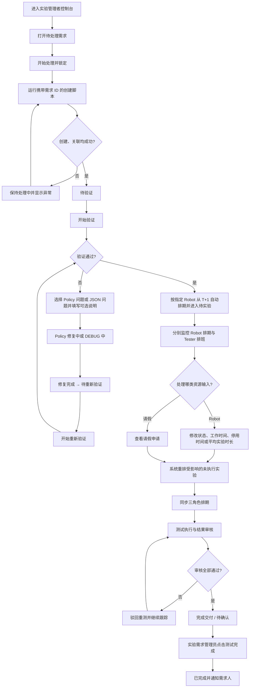

# PRD-005 实验管理者：资源维护与调度例外处理

角色说明：实验管理者（Experiment Manager；当前 UI 文案为“实验管理员”）  
关联 PRD：[PRD-004 实验需求方](./PRD-004-experiment-requester.md) · [PRD-006 实验员](./PRD-006-tester.md)  
替代：[PRD-002](../archive/2026/PRD-002-experiment-manager.md)  
共享契约：[实验调度共享契约](../shared/scheduling-contract.md)

长期角色与权限来源：[Roles and Permissions](../../roles-permissions.md)

## 1. Overview

### 1.1 Background

实验管理者负责维护调度系统所依赖的资源约束，而不是逐条安排班次。当前管理员控制台已拆分为“运行与资源”“实验需求管理”“实验员管理”三个页面，并实现 Robot 卡片、容量与利用率、Robot 日排期、Tester 日排期、Robot 状态与时间规则、批量配置、需求处理、实验详情、请假审批和应用内消息中心。Robot 排期只表达设备容量与占用，不再包含 Tester 排班或 Tester 配置。

需求提交后先进入“待处理”。当前原型由同一个“实验管理员”控制台打开需求并点击“开始处理”，锁定内容；随后触发脚本按需求 ID 创建并关联实验。全部创建成功后，控制台继续提供首次验证、问题分类、Policy / JSON 修复确认和重新验证；验证通过后进入测试执行。审核全部通过后 Requirement 进入“待确认”，实验需求管理员点击“测试完成”后才进入“已完成”并通知需求人。失败、遗漏或关联异常保持“处理中”，由当前处理人查看原因并重试。

生产 RBAC 中，Experiment Manager、Experiment Requirement Manager、Experiment Requirement Verifier 和 Requirements Validation Engineer 是不同角色。当前原型尚未执行该权限拆分，而是将 Requirement 处理与验证操作集中展示在同一管理员控制台；正式权限边界以 `docs/roles-permissions.md` 为准。

Experiment 使用 Requirement 组合中指定的 Robot，并最早从 Requirement 创建日期的次日开始排期。Robot 不可用时，系统在原 Robot 队列中顺延未开始的 Experiment，管理者不得通过日常例外处理将其自动切换到其他 Robot。

### 1.2 Goal

- 统一维护 Robot 工作时间、停机时间、状态和容量，并与 Tester 排班保持业务解耦。
- 审批实验员请假，并触发对未执行实验的自动重新计算。
- 处理待处理需求、触发实验创建，并按状态完成验证、问题分类、修复确认、重新验证和最终交付确认。
- 通过角色相关的消息中心及时进入需要处理的 Requirement。

### 1.3 Business Value

- 将管理者从手工排班转为资源治理与异常处置。
- 降低设备停机、请假和资格不匹配造成的执行冲突。
- 确保需求方、管理者和实验员看到同一份排期结果。

### 1.4 实现基线与差距

| 能力 | 当前原型 | PRD 要求 |
|---|---|---|
| Robot 列表、容量、排期 | 已实现 | 保持并接入权威数据 |
| 单机/批量可用规则 | 已模拟实现 | 保存后触发增量重排 |
| Robot 默认/备用 Tester | 已移除 | Robot 管理与 Robot 排期不维护 Tester 映射 |
| 请假审批 | 已模拟实现 | 只影响请假覆盖时段内的未执行实验 |
| Robot 排期手动指定 Tester | 已移除 | Tester 排班在独立人员模块处理 |
| 管理员三页信息架构 | 已实现 | 运行与资源、实验需求管理、实验员管理保持职责分离 |
| Requirement 六态列表与六阶段详情 | 已实现 | 与 PRD-004 和共享状态契约保持一致 |
| 待确认交付与测试完成 | 已模拟实现 | 由 Experiment Requirement Manager 执行正式授权 |
| 应用内消息中心 | 已模拟实现 | 当前为内存状态；持久化、重试与审计 TBD |
| Header 日期导航 | 仅更新日期标签 | 需要接入对应日期的排期数据 |
| Header 搜索 | 仅在运行与资源页过滤 Robot，且仍读取遗留 Tester 关联 | 需要按当前页面限定搜索范围，并移除 Robot 搜索对 Tester 映射的依赖 |
| 固定 Robot、T+1 与容量下限 | 当前模拟逻辑存在偏差 | 以本 PRD 业务规则为准，见 8.4“当前原型偏差” |
| Urgent 重排影响预览、审计 | 未实现 | TBD / 待实现 |

## 2. Scope

| 功能 ID | 功能 | 功能点 ID | 功能点 |
|---|---|---|---|
| EXP-007 | Experiment Detail | EXP-007.1 | View Experiment Detail Information |
| EXP-304 | Tester Schedule View | EXP-304.1 | View Tester Schedule |
| EXP-304 | Tester Schedule View | EXP-304.2 | View Daily Experiment Records |
| EXP-304 | Tester Schedule View | EXP-304.3 | View Experiment Status |
| EXP-304 | Tester Schedule View | EXP-304.4 | View Tester Workload |
| EXP-305 | Robot Schedule View | EXP-305.1 | View Robot Schedule |
| EXP-305 | Robot Schedule View | EXP-305.2 | View Daily Experiment Records |
| EXP-305 | Robot Schedule View | EXP-305.3 | View Robot Utilization |

### 待登记功能资产（不属于正式 Scope）

| 建议归属 | 建议功能 / 功能点 | 未匹配原因 | 状态 |
|---|---|---|---|
| Experiment Management / 新业务对象 Requirement | Requirement 处理、锁定、创建结果检查与确认 | `product-structure.md` 尚未登记 Requirement 业务对象，Excel 无对应功能点 | Pending Confirmation |
| Experiment Schedule | 自动排期、优先级重排、固定 Robot 队列、异常处理 | Excel 仅登记排期查看与筛选能力 | Pending Confirmation |
| Asset Management / Robot | Robot 列表、编辑、工作时间、停用时间与平均实验时长 | Excel 使用未在产品结构登记的业务对象名称 `Manage Robot`，且未登记这些独立、长期能力 | Pending Confirmation |
| System Configuration / User Management | Tester 请假审批与 Availability 管理 | Excel 无对应功能点 | Pending Confirmation |
| System Configuration / Notification | 管理者消息中心、未读状态与 Requirement 跳转 | Excel 无对应功能点 | Pending Confirmation |
| System Configuration / Role Management | Requirement 生命周期角色授权 | Excel 尚未登记新增 RBAC Role 对应的功能权限 | Pending Confirmation |

Scope 校验说明：Excel 中 `EXP-301.*`、`EXP-302.1` 和 `EXP-302.2` 同时被 Experiment Schedule 与 Flagged Annotation 使用；Robot 功能的业务对象又写作 `Manage Robot`，与产品结构中的 `Robot` 不一致。本 PRD 不把这些冲突项写入正式 Scope。

## 3. User Story

### US-001

> 作为实验管理者，
>
> 我希望维护 Robot 的可用和停机规则，
>
> 从而让系统基于真实设备容量自动排期。

### US-002

> 作为实验管理者，
>
> 我希望在独立的实验员管理模块审批请假并查看人员排班，
>
> 从而让系统只分配合格且可用的实验员。

### US-003

> 作为实验管理者，
>
> 我希望查看排期冲突并处理自动匹配失败的例外，
>
> 从而在不人工排班的前提下保障实验执行。

### US-004

> 作为实验管理者，
>
> 我希望从消息中心看到与当前职责相关的 Requirement 通知并直接进入详情，
>
> 从而及时处理需求、验证、异常与交付确认。

## 4. User Flow

### 4.1 Flow Diagram



### 4.2 Flow Description

| Step | User Action | System Behavior |
|---|---|---|
| 1 | 管理者进入控制台并选择页面 | 系统提供“运行与资源”“实验需求管理”“实验员管理”三个页面；Header 保留日期、搜索和消息通知入口 |
| 2 | 管理者打开待处理需求并开始处理 | 系统切换为“处理中”并锁定需求内容 |
| 3 | 管理者运行创建脚本 | 脚本携带需求 ID；实验创建后自动关联 |
| 4 | 创建或关联失败 | 需求保持“处理中”，管理员侧显示原因和重试；不退回需求方 |
| 5 | 全部创建成功 | “需求验证”显示“待验证”，操作区显示“开始验证” |
| 6 | 管理者开始验证 | 需求进入“验证中”，操作区显示“通过 / 不通过” |
| 7 | 管理者选择“不通过” | 系统要求选择 Policy 问题或 JSON 问题，并接受可选补充说明；需求分别进入“Policy 修复中”或“DEBUG 中” |
| 8 | 对应修复负责人确认 Policy 或 DEBUG 修复完成 | 系统更新原 Experiment，需求进入“待重新验证”，不得重新创建 Experiment；当前原型暂由管理员控制台集中展示入口 |
| 9 | 管理者开始重新验证并选择“通过” | 系统进入“测试执行 / 待实验”，并按指定 Robot 从 T+1 排期；再次不通过则返回对应修复流程 |
| 10 | 管理者进入实验员管理 | 系统展示 Tester 排期、Break 状态和待审批请假 |
| 11 | 管理者打开 Robot 详情 | 当前信息页展示状态、容量和今日实验；时间规则仅在设置页展示，不展示 Tester 配置 |
| 12 | 管理者保存 Robot 配置 | 系统仅按 Robot 容量与可用时段识别受影响的未执行实验 |
| 13 | 管理者批准或拒绝请假 | 批准时重排覆盖时段内的未执行实验；拒绝时保留原排期 |
| 14 | 重排完成 | 系统将结果同步给需求方、管理者和相关实验员 |
| 15 | 所有实验执行完成并通过审核 | Requirement 进入“完成交付 / 待确认”，系统向交付确认负责人发送通知 |
| 16 | 实验需求管理员点击“测试完成” | Requirement 更新为“已完成”，系统通知需求人查看最终结果 |
| 17 | 管理者打开消息中心并选择通知 | 系统标记消息已读，并在当前角色有权限时切换至“实验需求管理”并打开对应 Requirement 详情 |

### 4.3 Branch Flow

- Robot 恢复可用后，系统继续处理该 Robot 的固定队列；已合法顺延的 Experiment 是否自动前移为 TBD。
- 批量配置只作用于明确勾选的 Robot；未选择 Robot 时不得保存。
- 当前管理员页面不提供手动指定 Tester；匹配失败时显示异常并等待人员侧重新匹配或流程重试。
- Robot 不可用时，Experiment 保留在 Requirement 指定 Robot 的队列中顺延；管理者不得以自动重排为由替换 Robot。
- 当前原型将多个 Requirement 生命周期角色集中在一个管理员控制台；正式环境必须按 RBAC Role 决定可见 CTA 和可执行操作。

## 5. Feature List

| FR 编号 | 功能需求 | 描述 |
|---|---|---|
| FR-001 | 运营指标与异常入口 | 按当前管理员页面展示资源、需求或人员相关指标与待处理数量 |
| FR-002 | Robot 资源列表与详情 | 以可选择卡片查看 Robot 状态、容量、利用率、当前实验和有效时间配置 |
| FR-003 | Robot 单机可用性维护 | 维护单台 Robot 的状态、工作时间、停用时间和平均实验时长 |
| FR-004 | Robot 批量工作规则配置 | 对当前筛选结果中明确勾选的 Robot 批量覆盖时间配置 |
| FR-005 | Robot 与 Tester 排班解耦 | Robot 管理与 Robot 排期不展示、配置或指定 Tester |
| FR-006 | Robot / Tester 排期监控 | 在独立页面按 Robot 或 Tester 查看同一日的实验占用与冲突 |
| FR-007 | 请假审批与可用性更新 | 在实验员管理页批准或拒绝请假，并更新人员侧排期 |
| FR-008 | 自动重排与异常处置 | 根据资源变化重算未执行实验，并向管理者暴露异常结果 |
| FR-009 | 实验与来源需求追踪 | 从排期或需求进入实验详情，查看来源需求与实验配置 |
| FR-010 | 管理员需求处理、验证与交付流转 | 处理 Requirement、创建关联 Experiment、验证、修复、重新验证并确认交付 |
| FR-011 | 管理者消息中心 | 查看角色相关通知、未读数量和通知历史，并跳转到有权限的 Requirement 详情 |

## 6. Functional Requirement

### FR-001 运营指标与异常入口

#### 功能说明

“运行与资源”展示今日已排、Robot 可用数量、Robot 利用率和需要处理数量；“实验需求管理”展示全部需求数和预计关联实验数；“实验员管理”展示当前可用 Tester、待审批请假和临时 Break 数量。导航 Tab 对运行异常和待审批请假显示数量徽标。

#### Data / Content

指标必须由当前统一排期数据计算，不使用与排期脱节的静态数字。

### FR-002 Robot 资源列表与详情

#### 功能说明

管理者可按状态筛选 Robot，并通过四列卡片查看 Robot 状态、已排/容量、利用率、当前实验、下次可用时间和当前生效的工作/停用时间；窄屏响应为两列或单列。每张卡片提供独立勾选框，Header 提供当前筛选结果的全选。Robot 管理不使用包裹整个区域的大型容器，Section Header 与卡片网格直接排列在页面内容画布上。点击 Robot 后，当前信息页只展示运行概览和今日实验；时间规则仅在设置页展示。Robot 列表、详情与设置均不展示或编辑 Tester。

### FR-003 Robot 单机可用性维护

#### Fields

| 字段 | 类型 | 必填 | 规则 |
|---|---|---:|---|
| 状态设置 | Select | 是 | 在线、已暂停、维护中；在线状态下由排期显示运行中或空闲 |
| 每日工作开始/结束 | Time | 是 | 当前 Robot 的单机覆盖值 |
| 停用时间开始/结束 | Time | 是 | 当前 Robot 的单机覆盖值 |
| 平均实验时长 | Select | 是 | 当前 Robot 的单机覆盖值 |

#### 功能说明

详情设置展示平台默认配置与当前 Robot 的有效配置；保存单机配置后仅覆盖当前 Robot 并重新计算其容量。设置为暂停或维护会令对应容量变为 0；选择“在线”后，系统根据当前排期返回“运行中”或“空闲”。不提供额外不可排时段的新增功能。

### FR-004 Robot 批量工作规则配置

#### Fields

| 字段 | 类型 | 必填 |
|---|---|---:|
| 每日工作开始/结束 | Time | 是 |
| 默认停用/休息开始/结束 | Time | 是 |
| 平均实验时长 | Select | 是 |

#### 规则

每张 Robot 卡片提供独立勾选框，顶部 Header 提供“全选”与批量设置图标按钮。未选择 Robot 时批量设置按钮不可用；“全选”仅选择当前筛选结果。预计容量 = floor((工作跨度 − 停用时长) / 平均实验时长)。应用后配置只覆盖已选择的 Robot（包括这些 Robot 已有的单机覆盖），并重新计算其容量与未执行实验。之后允许在单机详情中独立修改同一组字段。

### FR-005 Robot 与 Tester 排班解耦

#### 功能说明

Robot 排期只按设备工作时间、停用时段、容量和占用生成。Tester Availability、Break、请假或人员冲突不得改变 Robot 排期格的合法性。

#### 规则

- Robot 管理列表不展示 Tester 列。
- Robot 详情和设置不展示默认/备用 Tester，也不提供选择 Tester 的控件。
- Robot 排期格不展示 Tester，不提供“指定 Tester”入口。
- Tester 的个人任务、Break 和请假继续在实验员管理与实验员控制台独立处理。

### FR-006 Robot / Tester 排期监控

#### 功能说明

管理者在“运行与资源”按 Robot 查看设备排期，在“实验员管理”按 Tester 查看人员排期。两个视图共享时间轴和实验详情入口，但分别表达设备容量与人员冲突。

#### UI / Interaction

- Robot 时间格展示状态、实验和 Policy；Tester 时间格可展示对应 Robot。
- 同一 Tester 同时被分配多个实验时显示冲突。
- Robot 停机只影响 Robot 排期；Break 与请假只影响 Tester 排班及人员任务反馈。

### FR-007 请假审批与可用性更新

#### 功能说明

管理者可批准或拒绝待审批请假。批准后，仅在申请时间范围内将 Tester 标记为不可用，并重排该范围内受影响的未执行实验；拒绝后不改变可用性和排期。

#### Data / Content

请假卡片展示 Tester、起止时间、原因、状态和批准/拒绝操作。

### FR-008 自动重排与异常处置

#### 功能说明

Robot 约束变化后，系统只依据 Robot 容量和可用时段识别并重排受影响的待执行实验。管理者不直接拖拽或编辑 Robot 排期，也不在 Robot 排期中指定 Tester。Tester 的可用性变化在独立人员排班中处理，不改变 Robot 排期格。

#### 排序规则

1. 最早从 Requirement 创建日期的次日（T+1）开始排期。
2. Urgent 优先于 Normal。
3. 同优先级按 Requirement 创建时间 FIFO。
4. 同一 Requirement 下按 Experiment 创建顺序。
5. 当日容量不足时顺延至指定 Robot 的下一可用日期。
6. 新增 Urgent 只调整尚未开始的 Experiment，不影响正在执行或已完成的 Experiment。

#### 影响预览

生产版本在保存高影响配置前应展示受影响实验数量、Urgent 数量和可能顺延范围；当前原型仅提供保存后的 Toast，影响预览待实现。

### FR-009 实验与来源需求追踪

#### 功能说明

管理者可从 Robot 卡片当前实验、Robot 排期或 Tester 排期打开实验详情，并查看来源需求、需求人、配置、优先级、Robot 和系统排期。管理者从需求队列打开的是 Requirement 详情，可在“关联实验”Tab 查看该需求下的 Experiment。Tester 信息属于实验执行上下文，不作为 Robot 排期资源字段。

### FR-010 管理员需求处理与验证流转

#### 功能说明

管理员依次执行“开始处理”和“关联创建实验”。系统在创建后自动按需求 ID 关联实验。创建成功后 Stepper 显示“需求验证 / 待验证”，对应验证角色依次使用“开始验证 → 通过 / 不通过”推进流程。不通过时必须选择 Policy 问题或 JSON 问题，并可填写补充说明；修复完成后进入待重新验证，再次验证通过后进入“测试执行 / 待实验”。创建或关联失败时，操作区只显示明确原因和“重试”。当前原型把上述角色 CTA 集中在同一管理员控制台，正式环境必须按 RBAC 拆分。

Requirement 详情包含“需求配置”“关联实验”“消息通知”三个 Tab，并使用固定六阶段 Stepper 展示当前阶段和内部状态。结果审核全部通过后显示“完成交付 / 待确认”；只有 Experiment Requirement Manager 点击“测试完成”后，Requirement 才进入“已完成”并向需求人发送完成通知。

“实验需求队列”的状态列必须与需求方“我的需求”共用同一个 Requirement Status 映射，只显示“待处理、处理中、实验中、待确认、已完成、已取消”。管理员队列不得直接显示“已排期”“进行中”、内部 Stage / Status 或任一关联 Experiment 的 Status。当前优先级筛选“全部 / 紧急”保持不变；若未来增加 Requirement Status 筛选，必须使用同一组六态选项及“全部”。

需求详情 Stepper 使用共享的六阶段契约；创建、验证、Policy 修复、DEBUG 和重新导出等具体处理状态不得替代固定 Stage 名称。完整映射引用[实验调度共享契约](../shared/scheduling-contract.md#需求详情-stepper-阶段契约)。

需求验证发现 Policy 或实验配置 JSON 问题时，Requirement 保持在“需求验证”，分别显示“Policy 修复中”或“DEBUG 中”。修复结果必须写回原 Experiment 并继续验证，不重新创建 Experiment；修复失败时再次进入对应修复流程，不回退到“实验创建”。

Requirement Status 的跨角色映射引用[实验调度共享契约](../shared/scheduling-contract.md#跨角色需求列表-requirement-status-投影)，不得在管理员模块维护第二套映射。

### FR-011 管理者消息中心

#### 功能说明

管理员控制台 Header 显示当前角色可接收的 Requirement 通知和未读数量。消息按最新优先展示标题、正文、Requirement ID、产生时间与已读状态；用户可逐条标记已读或执行“全部已读”。选择有权限查看的通知后，系统切换至“实验需求管理”并打开对应 Requirement 详情。

#### 当前实现限制

- 通知及已读状态保存在浏览器内存中，刷新后重置。
- 生产持久化、跨设备同步、失败重试、去重与审计保存期限为 TBD。

## 7. Acceptance Criteria

### FR-010-AC-01

```text
Given 需求处于“待处理”
When 管理员点击“开始处理”并点击“关联创建实验”
Then 系统自动创建并关联实验
And “需求验证”显示“待验证”
And 操作区显示“开始验证”
```

### FR-010-AC-02

```text
Given 实验创建或关联失败
When 管理员查看需求处理区
Then 需求保持“处理中”
And 处理区显示失败原因和“重试”
And 不显示“开始验证”
```

### FR-010-AC-03

```text
Given 全部实验创建和关联成功
When 管理员查看需求处理区
Then “开始验证”自动变为可用
```

### FR-010-AC-04

```text
Given 创建结果进入 DEBUG、重新导出或重新验证
When 管理员查看需求详情 Stepper
Then Stepper 始终停留在“需求验证”
And 第二层文案显示当前具体 Status
And 不增加额外流程节点
```

### FR-010-AC-05

```text
Given “需求验证”处于“待验证”
When 管理员点击“开始验证”
Then 需求进入“验证中”
And 操作区显示“通过”和“不通过”
```

### FR-010-AC-06

```text
Given 同一个 Requirement 同时出现在需求方“我的需求”和管理员“实验需求队列”
When 系统根据当前内部 Stage / Status 计算 Requirement Status
Then 两个列表显示完全相同的“待处理、处理中、实验中、待确认、已完成、已取消”之一
And 管理员列表不显示“已排期”“进行中”或单个 Experiment Status
```

### FR-010-AC-07

```text
Given 需求验证发现 Policy 或实验配置 JSON 问题
When 修复完成并通过重新验证
Then 系统更新原 Experiment 的 Policy 或 JSON
And 原 Experiment 继续进入测试执行
And 系统不重新创建 Experiment
```

### FR-010-AC-08

```text
Given Policy 或 JSON 修复后仍未通过验证
When 管理者查看需求详情
Then Requirement 继续停留在“需求验证”
And 再次进入对应修复流程
And 不回退到“实验创建”
```

### FR-010-AC-09

```text
Given Requirement 下需要审核的结果均已通过且当前聚合状态为“待确认”
When 具备交付确认权限的 Experiment Requirement Manager 点击“测试完成”
Then Requirement 更新为“已完成”
And 需求方与管理者列表同步显示“已完成”
And 系统向需求人发送最终结果可查看通知
And 在该操作完成前两个列表均保持显示“待确认”
```

### FR-001-AC-01

```text
Given 当前存在 Robot 排期异常或待审批请假
When 管理者打开控制台
Then 系统展示准确的待处理数量并提供对应入口
```

### FR-001-AC-02

```text
Given 管理者在三个管理页面间切换
When 页面完成加载
Then “运行与资源”展示设备排期与异常指标
And “实验需求管理”展示需求及关联实验统计
And “实验员管理”展示人员可用性、请假与 Break 指标
And 待处理徽标与当前权威数据一致
```

### FR-003-AC-01

```text
Given Robot 上存在待执行实验
When 管理者将 Robot 设置为维护中并保存
Then Robot 容量变为 0
And 系统只重排该 Robot 上受影响的未执行实验
And 已完成及正在执行的实验不变
```

### FR-003-AC-02

```text
Given 批量设置已配置
When 管理者在某一 Robot 详情中修改每日时间配置并保存
Then 仅当前 Robot 使用单机覆盖值并重新计算容量
And 其他 Robot 继续使用批量设置
```

### FR-004-AC-01

```text
Given 管理者已勾选一个或多个 Robot 并打开 Header 中的 Robot 批量设置
When 管理者保存并应用
Then 相同配置只应用到已勾选 Robot
And 已勾选 Robot 的现有单机覆盖被新的批量设置重置
And 系统只重新计算已勾选 Robot 的容量
And 未勾选 Robot 的配置和容量保持不变
```

### FR-005-AC-01

```text
Given 管理者打开 Robot 列表、详情、设置或 Robot 排期
When 页面完成渲染
Then 不展示 Tester 列、默认/备用 Tester、Tester 选择控件或指定 Tester 入口
And Robot 排期格只展示实验、Policy 与设备占用状态
```

### FR-006-AC-01

```text
Given 同一 Tester 在同一时段关联两个待执行实验
When 管理者查看 Tester 排期
Then 系统显示冲突而不是将两个实验显示为合法排期
```

### FR-007-AC-01

```text
Given Tester 提交了有效请假申请
When 管理者批准申请
Then 申请状态更新为已批准
And 申请时间范围内的人员任务在 Tester 排班中自动匹配其他可用 Tester 或新时间
And 申请范围外的实验保持不变
```

### FR-007-AC-02

```text
Given Tester 提交了请假申请
When 管理者拒绝申请
Then 申请状态更新为已拒绝
And 原实验排期保持不变
```

### FR-008-AC-01

```text
Given Tester Break、请假或人员冲突发生
When 管理者查看 Robot 排期
Then Robot 排期格和容量不因 Tester 状态而变化
And 人员侧影响只显示在 Tester 排班或实验员任务中
```

### FR-008-AC-02

```text
Given 指定 Robot 变为不可用且存在尚未开始的 Experiment
When 系统执行自动重排
Then Experiment 保留在该 Robot 队列并顺延至下一可用日期
And 系统不得自动更换 Robot
```

### FR-008-AC-03

```text
Given 同一 Robot 队列存在不同优先级或相同优先级的 Requirement
When 系统生成或重新计算队列
Then 按 Urgent > Normal 排序
And 同优先级按 Requirement 创建时间 FIFO
And 同一 Requirement 内按 Experiment 创建顺序排序
And 最早排期日期不早于 Requirement 创建日期的次日
```

### FR-011-AC-01

```text
Given 当前角色存在未读且有权查看的 Requirement 通知
When 管理者打开消息中心并选择该通知
Then 系统将该通知标记为已读
And 切换到“实验需求管理”
And 打开通知所关联的 Requirement 详情
```

### FR-011-AC-02

```text
Given 消息中心存在多条未读通知
When 管理者点击“全部已读”
Then 当前角色可见通知全部更新为已读
And Header 未读数量同步更新为 0
And 其他角色的通知状态不受影响
```

### FR-008 重排决策表

| 变化事件 | 影响对象 | 自动处理 | 管理者动作 |
|---|---|---|---|
| Robot 暂停/维护 | 该 Robot 的未执行实验 | 仅按 Robot 可用时段顺延 | 查看设备排期结果 |
| Robot 工作时间、停用时间或平均时长变化 | 该 Robot 上不再满足新约束的未执行实验 | 在同一 Robot 队列迁移到下一合法时段 | 查看结果 |
| 请假批准 | 请假覆盖的人员任务 | 在 Tester 排班中改派或顺延，不改变 Robot 排期 | 审批后查看人员侧例外 |
| Break 开始 | Break 后受影响的人员任务 | Tester 排班动态校准或改派 | 仅监控 |
| Urgent 进入 | 竞争时段内的未执行 Normal | Urgent 前置、Normal 顺延 | 查看影响；不手工排班 |

## 8. States & Rules

### 8.1 Robot 状态

| 状态 | 是否可被新排期使用 | 说明 |
|---|---:|---|
| 运行中 | 是（剩余可用时段） | 系统根据当前排期判定，管理者不可直接设置 |
| 空闲 | 是 | 系统根据当前排期判定，管理者不可直接设置 |
| 已暂停 | 否 | 临时不可用，需管理者恢复 |
| 维护中 | 否 | 维护期内不可用 |

“在线（根据排期显示状态）”是管理设置，不是新的 Robot 业务状态。它用于清除“已暂停/维护中”的人工覆盖，恢复后由系统输出运行中或空闲。

### 8.2 请假状态

| 状态 | 可执行动作 | 对排期影响 |
|---|---|---|
| 待审批 | 批准、拒绝 | 暂不改变正式 Availability |
| 已批准 | 查看 | 覆盖时段不可用并触发重排 |
| 已拒绝 | 查看 | 无影响 |

### 8.3 Requirement 聚合状态

管理者“实验需求队列”与需求方“我的需求”必须使用共享 Requirement Status 投影，详细映射以[实验调度共享契约](../shared/scheduling-contract.md#跨角色需求列表-requirement-status-投影)为唯一来源。

| 聚合状态 | 管理者侧含义 | 关键规则 |
|---|---|---|
| 待处理 | 需求已提交，尚未正式进入处理 | 允许需求方按权限修改或删除；管理者可开始处理 |
| 处理中 | 实验创建、验证、修复或重新验证进行中 | 内部状态只在详情 Stepper 展示，不替代列表聚合状态 |
| 实验中 | 已通过验证，处于正式执行、审核或驳回重测 | 列表不得显示单个 Experiment Status |
| 待确认 | 所需审核已通过，等待具备权限的角色确认交付 | 点击“测试完成”前不得提前显示“已完成” |
| 已完成 | 已完成交付确认 | 需求方可查看最终结果 |
| 已取消 | Requirement 已取消 | 保留需求与关联实验的历史记录；后续实验处置规则 TBD |

### 8.4 当前原型偏差（不改变确认规则）

以下内容是对当前 App 的实现审计，不构成业务规则变更。实现迭代应以本 PRD 与共享契约的确认规则为准。

| 当前原型行为 | 与确认规则的偏差 | 目标行为 |
|---|---|---|
| 创建/关联实验时，指定 Robot 不可用会选择备用 Robot | 违反固定 Robot 队列规则 | Experiment 保留在 Requirement 指定 Robot 队列并顺延 |
| Robot 设置为暂停或维护后，部分未完成实验会迁移到备用 Robot，且未严格排除运行中实验 | 违反固定 Robot 与仅重排未执行实验规则 | 只顺延同一 Robot 上尚未开始的 Experiment；运行中和已完成不变 |
| 初次排期可能从需求创建当天开始 | 违反 T+1 规则 | 最早排期日为 Requirement 创建日期次日 |
| 容量计算使用最小值 1 | 会把零容量或无效配置错误地变为可排 | 无效配置阻止保存；合法计算为 0 时不得强制改为 1 |
| 时间范围缺少完整的前后关系和包含关系校验 | 可能保存工作开始晚于结束、停用时间超界等配置 | 保存前完成字段级校验并给出明确错误 |
| Header 日期切换只更新日期标签 | 排期内容没有随日期变化 | Robot / Tester 排期和统计均切换到所选日期 |
| Header 搜索只过滤 Robot，并读取遗留 Tester 关联字段 | 搜索范围与当前页面不一致，且重新引入已移除的 Robot–Tester 依赖 | 按当前页面搜索对应对象；Robot 搜索不依赖 Tester 映射 |
| Requirement 详情 Header 可能显示“已完成”，而 Stepper 仍为“待确认” | 同一对象同时出现两个聚合状态 | Header、列表和 Stepper 投影必须共同显示“待确认”，直至“测试完成” |
| Requirement 处理、验证、修复和交付 CTA 集中在同一管理员控制台 | 尚未执行正式 RBAC | 按角色权限控制页面、CTA、数据范围和通知接收者 |

### 8.5 业务规则

- BR-MGR-001：管理者维护约束和审批，不负责日常人工排班。
- BR-MGR-002：任何配置保存都先形成有效资源约束，再由统一调度服务计算结果。
- BR-MGR-003：重排只作用于受影响的未执行实验。
- BR-MGR-004：管理者可设置在线、已暂停或维护中；在线时运行中与空闲必须由系统根据当前排期自动返回。
- BR-MGR-004A：Robot 管理和 Robot 排期不得提供 Tester 配置、展示或手动指定功能。
- BR-MGR-004B：批量设置与单机设置使用同一组工作时间、停用时间和平均实验时长字段；批量应用只覆盖已勾选 Robot，单机保存只覆盖当前 Robot。
- BR-MGR-005：已批准请假只在批准的起止时间内生效。
- BR-MGR-006：同一资源变化只能产生一个可审计的重排批次，幂等规则 TBD。
- BR-MGR-007：需求方与实验员视图不得维护独立排期副本。
- BR-MGR-008：Experiment 使用 Requirement 指定的 Robot；Robot 不可用时在原队列顺延，不自动更换 Robot。
- BR-MGR-009：最早从 T+1 排期；顺序为 Urgent > Normal、同优先级 Requirement FIFO、同 Requirement 下 Experiment 创建顺序。
- BR-MGR-010：Policy 或 JSON 修复更新原 Experiment 并继续验证，不重新创建 Experiment。
- BR-MGR-011：需求方与管理者列表必须使用同一 Requirement Status 投影，不得由页面各自推导第二套状态。
- BR-MGR-012：审核全部通过后 Requirement 先进入“待确认”；只有具备权限的 Experiment Requirement Manager 点击“测试完成”后才进入“已完成”。
- BR-MGR-013：生产环境必须按 `docs/roles-permissions.md` 中的正式 RBAC Role 控制 Requirement 生命周期操作；角色名称不得被具体人员姓名替代。
- BR-MGR-014：消息中心只展示当前角色有权接收的通知；通知跳转前必须再次校验 Requirement 查看权限。

## 9. Edge Cases

| Case | 系统处理 |
|---|---|
| 批量工作时段早于/等于结束时段校验失败 | 阻止保存并指出错误字段 |
| 休息时段超出工作时段 | 阻止保存 |
| 平均时长导致容量为 0 | 提示配置不可用；不得强制设为 1 |
| Robot 停机与 Urgent 实验同时发生 | 保持执行中实验；对未执行实验按 Urgent 优先重排 |
| Robot 长时间不可用 | Experiment 保留在指定 Robot 队列并继续顺延；不得自动切换 Robot，管理者可查看等待资源原因 |
| Tester 同时 Break 或请假 | 只在 Tester 排班中处理改派或顺延，不改变 Robot 排期 |
| 请假与 Break 重叠 | 请假获批后以请假为正式不可用来源；避免重复重排 |
| 两名管理者同时审批 | 只接受第一次合法状态迁移；后续请求返回最新状态 |
| 重排服务失败 | 保留上一个合法排期，显示失败范围并允许重试；不得发布部分未知结果 |
| Robot 恢复后是否回迁实验 | 当前不自动回迁；长期策略 TBD |
| 当前原型刷新 | 恢复初始 Mock 数据；生产环境必须持久化并记录审计 |
| Policy 修复或 DEBUG | 保持在“需求验证”；修复后更新原 Experiment 并继续验证，不重新创建 Experiment |
| 修复后仍未通过验证 | 再次进入对应修复流程，不回退到“实验创建” |
| 待确认阶段 Header 与列表状态不一致 | 统一按共享 Requirement Status 投影显示“待确认”；不得根据底层完成标志提前显示“已完成” |
| 管理者点击无权访问对象的通知 | 不打开详情；提示权限不足并保留通知记录 |
| Header 日期切换但排期数据加载失败 | 保留当前已发布数据并提示加载失败，不得只改变日期标签造成误解 |
| 页面级搜索无匹配结果 | 显示当前页面的空结果状态；不跨页面或通过遗留 Tester 关联命中 Robot |
