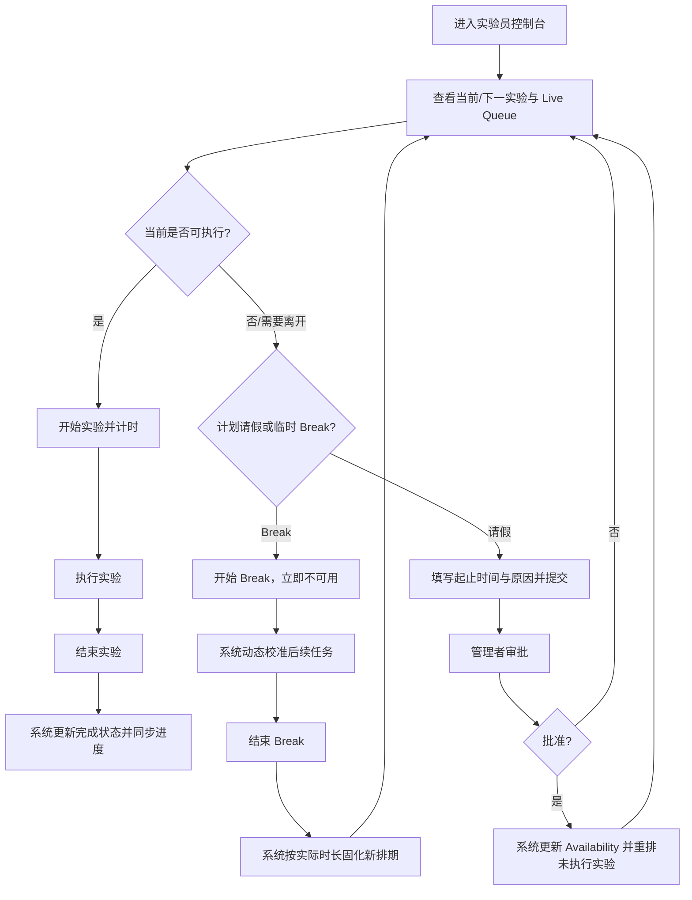

# PRD-006 实验员：任务执行与个人可用性

角色：实验员（Tester）  
关联 PRD：[PRD-004 实验需求方](./PRD-004-experiment-requester.md) · [PRD-005 实验管理者](./PRD-005-experiment-manager.md)  
替代：[PRD-003](../archive/2026/PRD-003-tester.md)  
共享契约：[实验调度共享契约](../shared/scheduling-contract.md)

## 1. Overview

### 1.1 Background

实验员是实验的执行者。当前项目已实现个人 10:00–19:00 Live Queue、当前/下一任务、开始与结束计时、请假申请、请假记录、临时 Break 及 Break 后排期校准。

实验员不自行选择新任务或编辑排期。系统只向实验员分配其具备目标 Robot 操作资格、且与个人可用时间不冲突的实验。当实验员请假获批或开启 Break 时，统一调度服务更新其 Availability，并重新计算受影响的未执行实验。Experiment 的 Robot 由来源 Requirement 组合指定；Robot 不可用时任务在原 Robot 队列中顺延，不自动更换 Robot。

### 1.2 Goal

- 让实验员清晰查看自己的当日任务、空闲时段和资源信息。
- 支持实验开始、计时、完成等执行状态闭环。
- 通过请假和 Break 准确维护个人可用性，并获得重排反馈。

### 1.3 Business Value

- 减少实验员在聊天、表格和排期工具之间切换。
- 防止不可用或无操作资格的实验员被错误分配。
- 将现场临时变化快速反馈给全局排期。

### 1.4 实现基线与差距

| 能力 | 当前原型 | PRD 要求 |
|---|---|---|
| 当日完整队列 | 已实现 | 保持并使用权威排期数据 |
| 开始/结束与计时 | 已模拟实现 | 增加服务端状态和并发校验 |
| 请假提交/历史 | 已实现 | 增加时间校验、撤回/修改策略 TBD |
| Break 即时生效 | 已模拟实现 | 明确影响范围和改派/顺延策略 |
| 资格校验 | 依赖 Mock 默认/备用 Tester | 生产排期必须使用正式资格数据 |
| 通知、持久化、外部执行结果 | 未实现 | TBD |

## 2. Scope

| 功能 ID | 功能 | 功能点 ID | 功能点 |
|---|---|---|---|
| EXP-007 | Experiment Detail | EXP-007.1 | View Experiment Detail Information |
| EXP-304 | Tester Schedule View | EXP-304.1 | View Tester Schedule |
| EXP-304 | Tester Schedule View | EXP-304.2 | View Daily Experiment Records |
| EXP-304 | Tester Schedule View | EXP-304.3 | View Experiment Status |

### 待登记功能资产（不属于正式 Scope）

| 建议归属 | 建议功能 / 功能点 | 未匹配原因 | 状态 |
|---|---|---|---|
| Experiment Management / Experiment | Tester 开始、计时、完成实验 | Excel 未登记实验执行操作功能点 | Pending Confirmation |
| Experiment Schedule | 个人 Live Queue、重排结果与冲突反馈 | Excel 仅登记 Tester 排期查看能力 | Pending Confirmation |
| System Configuration / User Management | Tester 请假申请、记录与临时 Break | Excel 无对应功能点 | Pending Confirmation |

Scope 校验说明：Excel 中 `EXP-301.*`、`EXP-302.1` 和 `EXP-302.2` 存在 Experiment Schedule 与 Flagged Annotation 的重复定义，本 PRD 仅引用无冲突的 `EXP-304.*` 排期查看能力。

## 3. User Story

### US-001

> 作为实验员，
>
> 我希望查看完整的个人实验队列，
>
> 从而按系统排期使用正确 Robot 执行实验。

### US-002

> 作为实验员，
>
> 我希望开始、计时并完成分配给我的实验，
>
> 从而让各角色看到准确的执行进度。

### US-003

> 作为实验员，
>
> 我希望提交请假或开启临时 Break，
>
> 从而让系统及时调整我的可用性和后续任务。

## 4. User Flow

### 4.1 Flow Diagram



### 4.2 Flow Description

| Step | User Action | System Behavior |
|---|---|---|
| 1 | 实验员进入控制台 | 系统展示可用状态、当前/下一实验和完整工作日队列 |
| 2 | 实验员查看任务 | 系统展示实验 ID、Policy、Robot、计划时间和状态 |
| 3 | 实验员点击开始实验 | 系统校验任务归属、状态、时间和 Break；通过后进入进行中并启动计时 |
| 4 | 实验员点击结束实验 | 系统停止计时、将实验标记为已完成并同步关联需求进度 |
| 5 | 实验员提交请假 | 系统创建待审批记录；批准前不改变正式排期 |
| 6 | 管理者批准请假 | 系统将批准时段设为不可用并重排覆盖范围内的未执行实验 |
| 7 | 实验员开始 Break | 系统立即标记不可用并动态校准其后续待执行实验 |
| 8 | 实验员结束 Break | 系统按实际 Break 时长固化新时间或完成改派，并同步三个角色视图 |

### 4.3 Branch Flow

- Break 期间不得开始新实验；已经进行中的实验是否允许开始 Break 为禁止。
- 请假批准不应中止正在执行的实验；若请假开始时间已到且实验仍在进行，系统产生异常提示，处理规则 TBD。
- 若 Break 后原 Tester 无法在工作时间内完成后续任务，系统尝试改派合格 Tester或顺延至下一可用时段。
- Robot 不可用时只调整 Tester 和时间，Experiment 仍归属原指定 Robot。

## 5. Feature List

| FR 编号 | 功能需求 |
|---|---|
| FR-001 | 个人状态与当日队列 |
| FR-002 | 实验任务详情 |
| FR-003 | 开始实验与运行计时 |
| FR-004 | 结束实验与状态同步 |
| FR-005 | 请假申请与记录 |
| FR-006 | 临时 Break |
| FR-007 | 动态重排反馈 |

## 6. Functional Requirement

### FR-001 个人状态与当日队列

#### 功能说明

系统展示实验员当前 Availability、当前/下一实验以及 10:00–19:00 的完整队列。队列使用固定 30 分钟格展示有任务和空闲时段；生产版本的格长应跟随系统排期粒度。队列中的尚未开始任务遵循 Urgent > Normal、同优先级 Requirement 创建时间 FIFO、同 Requirement 下 Experiment 创建顺序；新任务最早从 Requirement 创建日期的次日进入排期。

#### Data / Content

每个任务展示计划时间、实验名称、实验 ID、Policy、Robot 和状态。空闲格明确表示无任务，不得省略导致时间轴不连续。

### FR-002 实验任务详情

#### 功能说明

实验员只能查看分配给自己的执行上下文，至少包括来源需求摘要、实验配置、Robot、Policy、物体/背景、计划时间和当前状态。实验员不得修改 Robot、Tester 或排期。

### FR-003 开始实验与运行计时

#### Entry / Trigger

实验状态为待执行、任务分配给当前实验员、当前实验员未处于 Break/已批准请假，且 Robot 可执行。

#### 功能说明

点击开始后，实验进入进行中并启动计时。同一实验的重复开始请求必须幂等；同一实验员同一时间不得有多个进行中实验。

### FR-004 结束实验与状态同步

#### 功能说明

实验员结束进行中的实验后，系统停止计时并将实验标记为已完成。系统同步更新个人队列、管理者视图、来源需求进度，并释放后续可用时间。

当前原型将“结束实验”直接等同于完成；生产环境是否需要结果上传、失败/中止原因和外部系统回传为 TBD。

### FR-005 请假申请与记录

#### Fields

| 字段 | 类型 | 必填 | 规则 |
|---|---|---:|---|
| 开始时间 | Datetime | 是 | 必须早于结束时间 |
| 结束时间 | Datetime | 是 | 必须晚于开始时间 |
| 原因 | Text | 是 | 去除首尾空格后不可为空 |

#### 功能说明

提交后生成待审批记录。实验员可查看申请时间、原因和状态。批准前不改变正式 Availability；批准后由系统重排覆盖时段内的未执行实验。

### FR-006 临时 Break

#### 功能说明

Break 无需审批，开始后立即将实验员标记为临时不可用并启动计时。结束 Break 后，系统按实际持续时间固化后续排期。

#### 约束

- 进行中实验存在时不可开始 Break。
- Break 期间不可开始实验或再次开始 Break。
- Break 只影响开始时间不早于 Break 开始、且尚未执行的实验。

### FR-007 动态重排反馈

#### 功能说明

Break、请假批准、Robot 停机或 Urgent 插队导致任务变化时，实验员队列自动显示最新 Tester、时间和状态。Robot 停机不改变 Experiment 的指定 Robot，只会导致其在原 Robot 队列顺延。若任务被改派给其他合格 Tester，则从当前实验员的待执行队列移除；历史变更记录方式 TBD。

## 7. Acceptance Criteria

### FR-001-AC-01

```text
Given 实验员进入控制台
When 查看 Live Queue
Then 系统连续展示 10:00–19:00 的全部 30 分钟时段
And 有任务与空闲时段高度一致
```

### FR-002-AC-01

```text
Given 一个实验未分配给当前实验员
When 当前实验员访问个人队列
Then 该实验不作为其可执行任务出现
```

### FR-003-AC-01

```text
Given 实验分配给当前实验员且状态为待执行
And 实验员当前可用
When 实验员点击开始实验
Then 实验状态更新为进行中并启动计时
```

### FR-003-AC-02

```text
Given 实验员处于 Break 或已批准请假时段
When 实验员尝试开始实验
Then 系统阻止开始并说明不可用原因
```

### FR-004-AC-01

```text
Given 实验正在由当前实验员执行
When 实验员点击结束实验
Then 系统停止计时并将实验更新为已完成
And 管理者和需求方视图同步更新
```

### FR-005-AC-01

```text
Given 请假开始时间不早于结束时间或原因为空
When 实验员提交申请
Then 系统拒绝提交且不创建请假记录
```

### FR-005-AC-02

```text
Given 有效请假申请已提交但尚未审批
When 实验员查看可用时间
Then 申请显示为待审批
And 原任务排期保持不变
```

### FR-006-AC-01

```text
Given 实验员没有进行中实验且当前未处于 Break
When 实验员开始 Break
Then Availability 立即变为 Break
And 后续未执行实验进入动态校准或改派
```

### FR-006-AC-02

```text
Given 实验员正在 Break
When 实验员结束 Break
Then 系统记录实际持续时间
And 将受影响实验固化为合法的新排期或等待资源状态
```

### FR-007-AC-01

```text
Given 某待执行实验因 Urgent、Robot 停机或请假获批被重新排期
When 重排成功
Then 实验员 Live Queue 展示最新时间并保留 Requirement 指定 Robot
And 不展示旧排期为当前有效排期
```

### FR-007-AC-02

```text
Given 分配给实验员的待执行 Experiment 所属 Robot 变为不可用
When 系统完成重排
Then Experiment 保留原指定 Robot
And 任务顺延到该 Robot 的下一可用时间，或显示等待资源
And 系统不得自动替换 Robot
```

### FR-007-AC-03

```text
Given 当前队列存在尚未开始的 Normal Experiment
When 新增 Urgent Experiment
Then Urgent 排到尚未开始的 Normal 之前
And 正在执行及已完成的 Experiment 位置和状态保持不变
```

### Availability 决策表

| 进行中实验 | 已批准请假覆盖当前时间 | Active Break | 可开始实验 | 可开始 Break |
|---|---|---|---:|---:|
| 否 | 否 | 否 | 是（仍需任务/Robot 校验） | 是 |
| 是 | 否 | 否 | 否 | 否 |
| 否 | 是 | 否 | 否 | 否 |
| 否 | 否 | 是 | 否 | 否 |

## 8. States & Rules

### 8.1 实验执行状态

| 状态 | 实验员可执行动作 | 可到达状态 |
|---|---|---|
| 待执行 | 开始实验 | 进行中、等待资源 |
| 进行中 | 结束实验 | 已完成；失败/中止为 TBD |
| 已完成 | 查看 | — |
| 等待资源/冲突 | 查看原因 | 待执行 |

### 8.2 Tester Availability

| 状态 | 含义 | 排期影响 |
|---|---|---|
| Available | 可接受新实验 | 可参与匹配 |
| Busy | 正在执行实验 | 当前时段不可重复分配 |
| Break | 临时不可用 | 立即影响后续未执行实验 |
| Leave Pending | 请假待审批 | 暂不改变正式排期 |
| On Leave | 已批准请假时段 | 不参与覆盖时段匹配 |

### 8.3 业务规则

- BR-TST-001：实验员只能执行分配给自己的实验。
- BR-TST-002：系统只能向具备目标 Robot 操作资格的实验员分配实验。
- BR-TST-003：同一 Tester 同一时段只能执行一个实验。
- BR-TST-004：Break 立即生效；请假仅在批准后生效。
- BR-TST-005：Availability 变化只重排受影响的未执行实验。
- BR-TST-006：执行状态变化必须同步到来源需求和管理者视图。
- BR-TST-007：Urgent / Normal 决定排期先后，但不允许中断正在执行的 Normal 实验。
- BR-TST-008：同优先级按 Requirement 创建时间 FIFO，同 Requirement 下按 Experiment 创建顺序。
- BR-TST-009：Experiment 使用 Requirement 指定的 Robot；Robot 不可用时在原队列顺延，不自动更换 Robot。
- BR-TST-010：实验最早从 Requirement 创建日期的次日（T+1）进入排期。

## 9. Edge Cases

| Case | 系统处理 |
|---|---|
| 实验员提前开始尚未到时间的任务 | 是否允许及容差范围 TBD；当前应至少校验资源无冲突 |
| Robot 在开始前变为维护中 | 阻止开始；Experiment 保留指定 Robot 并顺延到该 Robot 下一可用时间，不自动更换 Robot |
| 点击开始后网络重试 | 使用幂等请求返回同一进行中状态，不重复计时 |
| 进行中实验尝试 Break | 阻止并提示先结束/中止实验 |
| Break 跨过工作结束时间 | 超出当日的未执行实验顺延到下一可用时段或改派 |
| 请假与已有 Break 重叠 | 避免重复扣减 Availability 和重复重排 |
| 请假批准时已有进行中实验 | 不自动中断；提示管理者和实验员，具体处置 TBD |
| 结束实验失败 | 保持进行中并允许重试，不提前释放资源 |
| 任务被改派 | 从当前待执行队列移除并同步给新 Tester；通知方式 TBD |
| 当前原型刷新 | 计时和状态恢复为初始 Mock 数据；生产环境必须服务端持久化 |
