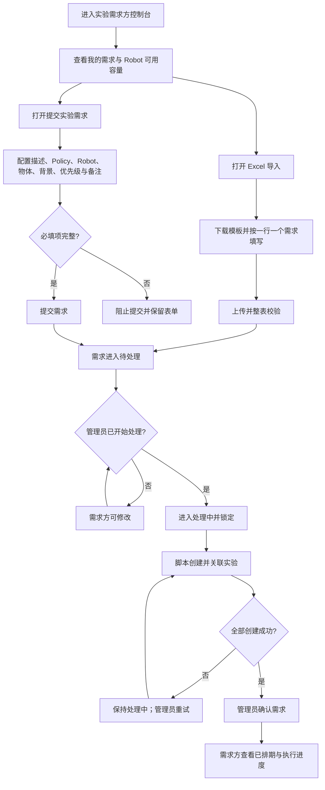

# PRD-001 实验需求方：需求提交与排期追踪

关联归档 PRD：[PRD-002 实验管理者](./PRD-002-experiment-manager.md) · [PRD-003 实验员](./PRD-003-tester.md)  
替代版本：[PRD-004 实验需求方](../../active/PRD-004-experiment-requester.md)  
共享契约：[实验调度共享契约](../../shared/scheduling-contract.md)

## 1. Overview

### 1.1 Background

实验需求方需要将 Policy、Robot、物体、背景和优先级等信息转化为可处理需求。当前项目已实现需求总览、资源日历、需求表单、Excel 批量导入、单独/按组组合配置、待处理阶段修改、处理后锁定、需求详情和关联实验追踪。

核心业务原则调整为：需求方提交后需求立即进入“待处理”，不直接创建实验。管理员开始处理前，需求方可修改；管理员开始后需求进入“处理中”并锁定。脚本按需求 ID 创建并关联实验，全部创建后由管理员点击“确认需求”直接进入“已排期”。当前原型暂不实现具体的需求验证规则。

当前原型使用内存 Mock 数据模拟排期，刷新页面后数据重置；自动排期与优先级重排尚不是生产级调度服务。

### 1.2 Goal

- 让需求方提交后立即获得可追踪需求。
- 允许需求方在管理员尚未开始处理的“待处理”阶段修改需求。
- 管理员开始处理后向需求方提供只读状态与关联实验结果，异常不退回需求方。

### 1.3 Business Value

- 减少需求到实验之间的人工拆单和沟通成本。
- 提前暴露 Robot 满载、停机或 Tester 不可用等资源风险。
- 为需求方提供统一、可追踪的执行预期。

### 1.4 实现基线与差距

| 能力 | 当前原型 | PRD 要求 |
|---|---|---|
| 需求配置与组合 | 已实现 | 保持 |
| 提交后创建实验 | 已改为需求处理流程 | 提交后仅进入待处理；管理员触发脚本创建 |
| Robot / Tester / 时间匹配 | 已模拟实现 | 生产环境由统一调度服务计算 |
| Urgent / Normal | 已展示并影响部分列表顺序 | 必须影响未执行实验的排期先后 |
| 动态重排结果同步 | 部分模拟实现 | 资源变化后统一同步需求与关联实验 |
| 数据持久化、通知、审计 | 未实现 | TBD |

## 2. Scope

| 功能 ID | 功能 | 功能点 ID | 功能点 |
|---|---|---|---|
| F-002 | Request creation | F-002.1 | Submit experiment request |
| F-002 | Request creation | F-002.2 | Configure single/group resource combinations |
| F-002 | Request creation | F-002.3 | View request configuration |
| F-003 | Automatic scheduling | F-003.1 | Preview shared Robot availability |
| F-003 | Work-order processing | F-003.2 | Create and link experiments by work-order ID |
| F-005 | Experiment detail | F-005.1 | View linked experiments |
| F-009 | Conflict handling | F-009.1 | View scheduling conflict and recalculation result |

## 3. User Story

### US-001

> 作为实验需求方，
>
> 我希望提交包含资源组合和优先级的实验需求，
>
> 从而让管理员按明确需求创建并确认可执行实验。

### US-002

> 作为实验需求方，
>
> 我希望在提交前查看 Robot 可用容量，
>
> 从而选择更合理的资源并形成可预期的执行计划。

### US-003

> 作为实验需求方，
>
> 我希望追踪需求、关联实验和动态排期结果，
>
> 从而及时了解实验是否已安排、执行或受资源变化影响。

## 4. User Flow

### 4.1 Flow Diagram



### 4.2 Flow Description

| Step | User Action | System Behavior |
|---|---|---|
| 1 | 需求方进入控制台 | 系统展示需求指标、我的需求和共享 Robot 排期数据 |
| 2 | 需求方切换日期或查看 Robot 排期 | 系统展示占用、可申请、待分配和不可排时段 |
| 3 | 需求方打开提交入口 | 系统展示需求配置表单和所选 Robot 的并列日历 |
| 4 | 需求方选择 Policy、Robot、物体和背景，并设置组合模式 | 系统实时保留单独使用或按组使用关系，计算预计实验数 |
| 5 | 需求方选择 Urgent / Normal 并提交 | 系统校验必填项，需求进入“待处理”，不创建实验 |
| 6 | 需求仍为待处理 | 需求方从详情点击“修改需求”，系统复用提交弹窗并完整回填所有字段；保存后状态不变 |
| 7 | 管理员开始处理 | 需求进入“处理中”，需求方视图变为只读 |
| 8 | 需求方打开需求详情 | 系统展示需求状态及脚本回写的关联实验；异常不要求需求方处理 |
| 9 | Robot 停机、Tester Break 或请假获批 | 系统重新计算受影响的未执行实验，并将结果同步到需求详情 |
| 10 | 需求方打开 Excel 导入并下载模板 | 系统提供与当前需求表单字段和组合结构一致的 `.xlsx` 模板 |
| 11 | 需求方上传已填写模板 | 系统校验工作表、表头、必填项、目录值、模式、分组和优先级；全部通过后按一行一个 Requirement 批量创建为“待处理” |

### 4.3 Branch Flow

- 若创建或关联未全部成功，需求保持“处理中”，需求方只读查看；管理员侧展示异常并重试。
- 若 Robot 被暂停、维护或新增不可排时段，系统不改变已完成或正在执行的实验，只重排受影响的待执行实验。
- 若取消需求表单，系统关闭表单且不创建需求或实验。

## 5. Feature List

| FR 编号 | 功能需求 |
|---|---|
| FR-001 | 需求总览与筛选 |
| FR-002 | 共享 Robot 可用性查看 |
| FR-003 | 实验需求配置与校验 |
| FR-004 | 实验组合计算 |
| FR-005 | 需求提交、锁定与实验回写 |
| FR-006 | 需求详情与关联实验追踪 |
| FR-007 | 动态排期结果同步 |
| FR-008 | Excel 批量创建实验需求 |

## 6. Functional Requirement

### FR-001 需求总览与筛选

#### 功能说明

需求方可查看全部需求、关联实验数量、今日可用容量和处理进度，并按“全部、待处理、处理中、测试中、已完成”筛选自己的需求。

#### Data / Content

需求列表至少展示：需求 ID、需求描述、Policy、Robot、Requirement Status 和详情入口。列表中的 Requirement Status 只允许为“待处理、处理中、测试中、已完成”，由 Requirement 当前内部流程自动计算；不得直接展示内部 Stage、Status 或任一关联 Experiment 的 Status。完整映射引用[实验调度共享契约](../../shared/scheduling-contract.md#跨角色需求列表-requirement-status-投影)。

### FR-002 共享 Robot 可用性查看

#### 功能说明

需求方可按日期查看 Robot 的占用、可申请、待分配和不可排时段。该数据必须与实验管理者控制台使用同一数据源。

#### UI / Interaction

- 支持今天、明天和后续日期切换。
- 选中多个 Robot 时，并列展示各 Robot 排期。
- 维护中或已暂停的 Robot 显示为不可排。
- 默认休息和管理员维护的额外停机时间显示为不可排时段。

### FR-003 实验需求配置与校验

#### 功能说明

需求方通过同一表单提交或修改实验需求。修改入口只在“待处理”状态可用；修改时必须回填需求描述、Policy、Robot、物体、背景、物体/背景使用方式、优先级和实验备注，所有字段均可重新编辑。

#### Fields

| 字段 | 类型 | 必填 | 规则 |
|---|---|---:|---|
| 需求描述 | Textarea | 是 | 去除首尾空格后不可为空 |
| Policy | Multi Select | 是 | 至少 1 个 |
| Robot | Multi Select | 是 | 至少 1 台；允许选择当前不可用 Robot，但必须明确风险 |
| 物体 | Multi Select / Group | 是 | 至少 1 个有效项 |
| 背景 | Multi Select / Group | 是 | 至少 1 个有效项 |
| 优先级 | Select | 是 | Urgent / Normal；UI 可显示为“紧急 / 普通” |
| 实验备注 | Textarea | 否 | 不参与排期计算 |

### FR-004 实验组合计算

#### 功能说明

系统根据 Robot、Policy、物体集合和背景集合生成实验组合，并保留物体、背景的单独/分组语义。

#### 组合规则

| 模式 | 规则 |
|---|---|
| 单独使用 | 每个所选项分别参与组合 |
| 按组使用 | 同一组内多个项作为一个实验资源整体 |
| 组合总数 | Robot 数 × Policy 数 × 物体组数 × 背景组数；组内项不再次拆分 |

当前原型内部仍有部分逻辑会将组内项展开为笛卡尔积；生产实现必须以本表为准，具体组内执行数据结构为 TBD。

### FR-005 需求提交、锁定与实验回写

#### 功能说明

需求提交成功后进入“待处理”。管理员开始处理前允许需求方通过已完整回填的提交弹窗修改全部配置；保存时保留原需求 ID，状态仍为“待处理”。开始处理后进入“处理中”并锁定。脚本必须携带需求 ID 创建实验，平台以该 ID 自动建立来源关联。创建或关联异常时需求保持“处理中”，且只在管理员侧显示原因与重试。全部创建完成后进入“需求验证 / 待验证”，管理员点击“确认需求”直接进入“测试执行 / 待测试”。

1. Robot 符合需求选择且在目标时段可用。
2. Tester 在目标时段可用，并具有该 Robot 操作资格。
3. 优先使用 Robot 的默认 Tester；不可用时使用合格备用 Tester。
4. Urgent 实验先于尚未执行的 Normal 实验占用可用时段。
5. 同一 Robot 与同一 Tester 在同一时段均不可重复分配。

#### Data / Content

每个实验必须保存来源需求、组合配置、优先级、Robot、Tester、计划起止时间和状态。

### FR-006 需求详情与关联实验追踪

#### 功能说明

需求方可查看只读需求配置和关联实验。关联实验至少展示实验 ID、名称、Policy、Robot、物体/背景、Tester、排期时间和状态。

需求详情 Stepper 使用固定 Stage：“需求处理 → 实验创建 → 需求验证 → 测试执行 → 结果审核 → 测试完成”。当前具体 Status 作为 Stage 下方的第二层文案显示，完整映射引用[实验调度共享契约](../../shared/scheduling-contract.md#需求详情-stepper-阶段契约)。DEBUG、重新导出与重新验证均停留在“需求验证”，不得新增 Step。

### FR-007 动态排期结果同步

#### 功能说明

Robot 或 Tester 可用性变化后，系统重新计算受影响的未执行实验，并将最新 Robot、Tester、时间和冲突状态同步到需求方视图。

#### Trigger

- Robot 状态或可用/停机时间变化。
- Tester 开始/结束 Break。
- Tester 请假被批准。
- 更高优先级需求进入队列。

### FR-008 Excel 批量创建实验需求

#### 功能说明

需求方可从“提交实验需求”旁边打开 Excel 导入弹窗，下载与当前表单数据结构一致的 `.xlsx` 模板，上传填写后的文件并批量创建需求。模板以一行表示一个 Requirement；导入成功的需求统一进入“待处理”，并沿用管理员开始处理前可修改的规则。

#### Data / Content

| Excel 列 | 表单字段 / 数据结构 | 规则 |
|---|---|---|
| 需求描述* | `description` | 必填 |
| Policy* | `policies` | 必填；多个值用中文或英文分号分隔；必须来自当前目录 |
| Robot* | `robotChoices` | 必填；多个值用中文或英文分号分隔；必须来自当前目录 |
| 物体使用方式* | `objectMode` | 单独使用 / 按组使用 |
| 物体* | `objectSets` | 组间用分号；按组使用时组内成员用 `+` |
| 背景使用方式* | `backgroundMode` | 单独使用 / 按组使用 |
| 背景* | `backgroundSets` | 分隔规则与物体一致 |
| 优先级* | `priority` | 普通 / 紧急；紧急映射为内部高优先级 |
| 实验备注 | `note` | 可选 |

模板包含“实验需求”“填写说明”“可选值”三个工作表。系统只读取“实验需求”，并要求保留原始表头。期望日期、平均时长、申请人、初始状态等当前表单未开放编辑的字段继续使用系统默认值。

#### Validation

- 仅接受 `.xlsx`。
- 忽略完全空白行；单次最多 200 个非空需求行。
- 所有非空行先统一校验，任何一行有误时整表不创建需求。
- 校验错误必须指出 Excel 行号和具体字段问题。

## 7. Acceptance Criteria

### FR-001-AC-01

```text
Given 需求方存在不同状态的需求
When 需求方选择某个状态筛选
Then 列表只展示 Requirement Status 与筛选值相同的需求
And 状态列只显示“待处理、处理中、测试中、已完成”之一
```

### FR-001-AC-02

```text
Given 需求内部 Status 为“DEBUG 中”
When 需求方查看“我的需求”列表
Then 状态列显示“处理中”
And 详情页仍显示“需求验证 / DEBUG 中”
```

### FR-001-AC-03

```text
Given 需求内部 Status 为“待审核”且关联多个 Experiment
When 系统计算 Requirement Status
Then 状态列显示“测试中”
And 系统不得直接采用任一单独 Experiment 的 Status
```

### FR-002-AC-01

```text
Given 管理者已将某 Robot 设置为维护中或添加不可排时段
When 需求方查看同一日期的 Robot 排期
Then 对应 Robot 或时段显示为不可排，且不可计入可用容量
```

### FR-003-AC-01

```text
Given 任一必填字段为空
When 需求方查看提交操作
Then 提交不可执行，系统不创建需求或实验
```

### FR-003-AC-02

```text
Given 需求处于“待处理”且已经保存完整配置
When 需求方从详情点击“修改需求”
Then 系统打开与提交需求相同的弹窗
And 完整回填需求描述、Policy、Robot、物体、背景、两类使用方式、优先级和实验备注
And 所有回填字段均可修改
```

### FR-003-AC-03

```text
Given 需求方在回填弹窗中修改了任意配置
When 需求方点击“保存修改”
Then 系统更新原需求且保留原需求 ID
And 需求状态仍为“待处理”
And 需求详情展示最新配置
```

### FR-004-AC-01

```text
Given 需求选择 2 台 Robot、2 个 Policy、2 个物体组和 1 个背景组
When 系统计算实验组合
Then 系统生成 8 个实验组合，并保留每组内部关系
```

### FR-005-AC-01

```text
Given 需求字段有效
When 需求方提交需求
Then 需求进入“待处理”且不创建实验
```

### FR-005-AC-02

```text
Given 存在 Urgent 和尚未执行的 Normal 实验竞争同一可用时段
When 系统执行排期或重排
Then Urgent 实验优先获得较早时段，Normal 实验被顺延且不发生资源重叠
```

### FR-005-AC-03

```text
Given Robot 在目标时段可用但没有具备该 Robot 操作资格的可用 Tester
When 系统执行排期
Then 实验进入等待资源/冲突状态，系统不得分配不合格 Tester
```

### FR-006-AC-01

```text
Given 需求已生成多个实验
When 需求方打开关联实验页签
Then 系统展示全部关联实验及其最新 Robot、Tester、排期和状态
```

### FR-006-AC-02

```text
Given 需求详情的当前 Status 为“DEBUG 中”或“待重新导出”
When 需求方查看需求配置页签中的 Stepper
Then 当前 Stage 固定显示为“需求验证”
And Stage 下方显示当前具体 Status
And 前序 Stage 为 Completed，后续 Stage 为 Pending
And 系统不为 DEBUG、重新导出或重新验证新增 Step
```

### FR-007-AC-01

```text
Given 一个待执行实验的 Robot 变为不可用
When 系统完成重新计算
Then 需求方看到该实验的新 Robot、Tester 和时间，或明确的等待资源状态
And 已完成及正在执行的实验保持不变
```

### FR-008-AC-01

```text
Given 需求方使用当前模板填写了多行有效需求
When 上传文件并点击批量创建
Then 系统按一行一个 Requirement 创建全部需求
And 每个 Requirement 的表单字段、组合模式和分组结构与 Excel 内容一致
And 每个 Requirement 的初始状态为“待处理”
```

### FR-008-AC-02

```text
Given 上传文件任一非空行存在未知目录值、缺少必填项或无效模式
When 系统完成整表校验
Then 系统展示对应 Excel 行号和错误原因
And 不创建文件中的任何 Requirement
```

### FR-008-AC-03

```text
Given 上传文件不是 .xlsx 或缺少“实验需求”工作表及原始表头
When 需求方选择该文件
Then 系统拒绝导入并提示重新下载模板
```

### FR-005 排期决策表

| Robot 可用 | 合格 Tester 可用 | 优先级 | 结果 |
|---|---|---|---|
| 是 | 是 | Urgent | 分配当前最早合规时段，并优先于未执行 Normal |
| 是 | 是 | Normal | 按队列顺序分配剩余最早合规时段 |
| 是 | 否 | 任意 | 等待资源/冲突，不分配 Tester |
| 否 | 任意 | 任意 | 尝试其他需求允许的 Robot；仍无资源则等待资源/冲突 |

## 8. States & Rules

### 8.1 需求状态

| 状态 | 含义 | 进入条件 | 可到达状态 |
|---|---|---|---|
| 待处理 | 已提交，管理员尚未开始 | 提交成功 | 处理中 |
| 处理中 | 管理员已开始，需求锁定；创建、关联、待确认或重试进行中 | 管理员点击开始处理 | 已排期 |
| 已排期 | 全部实验创建完成且需求已确认 | 管理员点击“确认需求” | 进行中、已完成 |
| 进行中 | 至少一个关联实验进行中 | Tester 开始实验 | 已完成 |
| 已完成 | 全部关联实验完成 | 最后一个实验完成 | — |

### 8.2 业务规则

- BR-SCH-001：需求提交后进入“待处理”；管理员开始前允许修改。
- BR-SCH-001A：管理员开始处理后锁定需求；脚本按需求 ID 创建并关联实验。
- BR-SCH-001B：失败保持“处理中”，仅管理员侧显示异常和重试；全部创建完成后才可确认需求。
- BR-SCH-002：Robot 决定实验在哪台设备执行。
- BR-SCH-003：Robot Availability 与 Tester Availability 的交集决定实验何时执行。
- BR-SCH-004：Tester 必须具有所分配 Robot 的操作资格。
- BR-SCH-005：Urgent 优先于所有尚未执行的 Normal；同优先级的稳定排序规则为 TBD。
- BR-SCH-006：已完成和正在执行的实验不参与自动重排。
- BR-SCH-007：动态重排结果必须同步到三个角色视图，并保持同一实验 ID。
- BR-SCH-008：所有排期时间按统一时区展示；当前原型为 GMT+8。

## 9. Edge Cases

| Case | 系统处理 |
|---|---|
| 选择了维护中 Robot | 允许保留需求选择，但明确不可用；调度尝试其他已选 Robot，否则进入等待资源 |
| 组合数超过调度服务上限 | 阻止提交或要求确认拆批；上限值 TBD，不得静默截断 |
| 同一需求重复提交 | 需要幂等键或用户确认；当前原型未实现 |
| 所有已选 Robot 无可用时段 | 需求进入等待资源，并展示下一可计算日期或 TBD |
| 无合格 Tester | 实验保持等待资源，不得绕过资格约束 |
| Urgent 导致 Normal 顺延 | 记录受影响实验并向需求方展示最新时间；通知机制 TBD |
| 资源变化发生在实验执行中 | 不迁移正在执行的实验，只影响后续未执行实验 |
| 提交或重排服务失败 | 保留用户输入/旧排期并提供重试；生产错误与恢复策略 TBD |
| 浏览器刷新 | 当前原型恢复初始 Mock 数据；生产环境必须持久化 |
