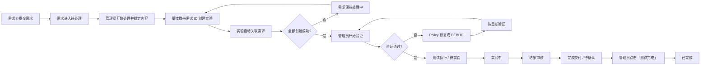
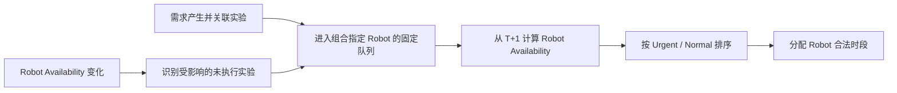

# 实验调度共享契约

> 文档类型：跨 PRD 共享契约  
> 适用 PRD：[PRD-004](../active/PRD-004-experiment-requester.md) · [PRD-005](../active/PRD-005-experiment-manager.md) · [PRD-006](../active/PRD-006-tester.md)  
> 状态：Confirmed  
> 最后更新：2026-09-02

## 统一业务主线

统一表述：

> 需求提交进入待处理 → 管理员开始处理并锁定 → 脚本按需求 ID 创建并关联实验 → 管理员完成验证与必要的修复 / 重新验证 → 进入测试执行并完成。

## 统一排期引擎契约

需求处理流程决定实验何时可以进入执行队列。Robot 排期只决定指定 Robot 的容量与设备可用时段；Tester 排班独立维护人员任务和可用性，二者不在 Robot 管理页面形成默认/备用人员映射。

| Rule ID | Rule |
|---|---|
| BR-SCH-001 | Requirement 产生 Experiment；实验创建和来源关联完成后，Experiment 才可进入排期。 |
| BR-SCH-002 | 每个 Experiment 使用 Requirement 组合中指定的 Robot，并保留在该 Robot 队列；Robot 不可用时顺延，不自动更换 Robot。 |
| BR-SCH-003 | Robot 排期只依据 Robot Availability、容量与占用计算；Tester Availability 不改变 Robot 排期格。 |
| BR-SCH-004 | Robot 管理不维护默认/备用 Tester，也不提供 Tester 选择或异常指定入口。 |
| BR-SCH-005 | 队列排序依次为 Urgent > Normal、同优先级 Requirement 创建时间 FIFO、同 Requirement 下 Experiment 创建顺序；不得中断正在执行的实验。 |
| BR-SCH-006 | 同一 Robot 在同一时段不得分配多个实验；Tester 冲突在独立人员排班中判断。 |
| BR-SCH-007 | Robot Availability 变化只重新计算 Robot 侧受影响的未执行实验；Tester Availability 变化不改写 Robot 排期。 |
| BR-SCH-008 | 已完成和正在执行的实验不参与自动重排。 |
| BR-SCH-009 | 排期结果以 Experiment ID 为键同步到需求方、实验管理者和实验员视图。 |
| BR-SCH-010 | 实验管理者维护资源约束、审批请假并处理无合法资源的例外，不负责日常手工排班。 |
| BR-SCH-014 | Experiment 最早从 Requirement 创建日期的次日（T+1）开始排期；当日容量不足时顺延到指定 Robot 的下一可用日期。 |
| BR-SCH-015 | Policy 或实验配置 JSON 修复时更新原 Experiment 并继续需求验证；修复失败时继续留在需求验证，不重新创建 Experiment 或回退实验创建。 |
| BR-SCH-016 | 待处理 Requirement 可经二次确认删除；进入处理中或实验中后不可删除。需求方可在任意阶段发起取消，但取消终态和下游处置规则为 TBD。 |
| BR-SCH-017 | 审核全部通过后 Requirement 进入“完成交付 / 待确认”；实验需求管理员点击“测试完成”确认交付后才进入“已完成”。 |

### 排期决策表

| Robot 可用 | Priority | Robot 排期结果 |
|---|---|---|
| 是 | Urgent | 分配当前最早合法时段，并优先于尚未执行的 Normal |
| 是 | Normal | 按 Requirement 创建时间 FIFO，再按同 Requirement 下 Experiment 创建顺序分配剩余最早合法时段 |
| 否 | 任意 | 保留指定 Robot，顺延到该 Robot 的下一可用日期；不得自动更换 Robot |

## 跨 PRD 交互契约

| 上游事件 | 系统处理 | 需求方结果 | 管理者结果 | 实验员结果 |
|---|---|---|---|---|
| 提交需求 | 进入“待处理” | 可在管理员开始前修改 | 在待处理队列打开需求 | 无任务变化 |
| 删除待处理需求 | 二次确认后删除且不再进入后续流程 | Requirement 从列表移除 | 不再进入待处理队列 | 无任务变化 |
| 发起取消 | 接收任意阶段的取消请求；终态与下游处置 TBD | 看到取消处理反馈 | 查看受影响 Experiment | 收到的任务是否撤回由待确认规则决定 |
| 管理员开始处理 | 锁定需求内容并进入“处理中” | 只读查看 | 运行创建脚本、检查关联实验 | 无任务变化 |
| 脚本创建实验 | 以需求 ID 建立来源关联 | 查看已回写实验 | 查看创建结果、异常原因并重试 | 尚未确认前不进入执行队列 |
| 验证通过 | 全部实验创建完成并通过首次或重新验证后进入“测试执行 / 待实验” | 查看排期结果 | 执行开始验证、通过 / 不通过、修复完成和重新验证 | 收到待执行任务 |
| Robot 暂停/维护/停机 | 在同一 Robot 队列按设备可用时段顺延未执行实验 | 看到最新 Robot 时间 | 看到设备影响与例外 | Robot 不变 |
| Tester 开始/结束 Break | 只校准 Tester 排班和人员任务，不改变 Robot 排期 | Robot 排期不变 | 看到 Break 与人员排班变化 | 看到顺延/改派结果 |
| 请假获批 | 只在批准时间范围内更新 Tester Availability 与人员任务 | Robot 排期不变 | 看到审批结果与人员侧例外 | 看到请假状态和更新后的队列 |
| Urgent 需求进入 | 优先安排 Urgent，顺延竞争中的未执行 Normal | 两类需求均看到最新时间 | 看到重排影响 | 看到更新后的任务顺序 |
| Policy / JSON 修复 | 更新原 Experiment 并继续需求验证 | 详情仍停留在需求验证 | 查看修复与重新验证结果 | 通过前不进入执行队列 |
| 实验开始/完成 | 更新 Experiment 执行状态；所有 Experiment 结束后进入结果审核，不直接完成 Requirement | 看到实验中或结果审核状态 | 看到执行与审核状态 | 看到计时和完成反馈 |
| 审核全部通过 | Requirement 进入“完成交付 / 待确认” | 列表显示待确认并等待管理员确认 | 查看最终测试结果并确认交付 | 无任务变化 |
| 管理员确认交付 | 点击“测试完成”后 Requirement 进入“已完成” | 列表显示已完成，可查看最终结果并确认已查看 | 看到已完成 | 无任务变化 |

## 统一数据与状态约束

- Request、Experiment、Robot、Tester Availability 和 Schedule 使用统一权威数据源；Robot 排期与 Tester 排班使用独立资源约束。
- 同一 Experiment ID 在三个角色视图中必须对应同一 Robot、Tester、计划时间和状态。
- 管理者负责开始处理、检查脚本创建结果、验证、问题分类、修复完成确认和重新验证；脚本负责创建实验并回写需求关联。
- 已完成和正在执行的实验不参与自动重排。
- Experiment 的 Robot 由 Requirement 组合指定并保持不变；排期最早从 T+1 开始。
- 排序使用 Urgent > Normal、同优先级 Requirement FIFO、同 Requirement 下 Experiment 创建顺序。
- 内部需求流程继续使用六阶段及其细粒度 Status；需求方“我的需求”列表只展示自动派生的 Requirement Status：待处理、处理中、实验中、待确认、已完成、已取消。
- “处理中”包含验证、Policy 修复、DEBUG 和重新验证；创建、关联和失败重试仍映射为“待处理”。
- 需求异常时保持“处理中”，异常原因与重试只在管理员侧展示。
- 当前项目为本地 Mock 交互原型，刷新会重置数据；生产持久化、通知、审计、并发和失败恢复仍为 TBD。

## 需求详情 Stepper 阶段契约

需求详情 Stepper 只表达固定流程阶段（Stage），具体处理状态（Status）仅作为当前阶段的第二层文案。Policy 修复、DEBUG、待重新验证与重新验证中均属于“需求验证”阶段内部状态，不新增流程节点。

| Stage | 可映射 Status |
|---|---|
| 需求处理 | 待处理 |
| 实验创建 | 待创建 |
| 需求验证 | 待验证、验证中、Policy 修复中、DEBUG 中、待重新验证、重新验证中 |
| 测试执行 | 待实验、实验中 |
| 结果审核 | 待审核、审核中、驳回重测 |
| 完成交付 | 待确认、已完成 |

当前 Stage 显示 Active 并展示当前 Status；之前的 Stage 显示 Completed；之后的 Stage 显示 Pending。流程整体已完成时，六个 Stage 均显示 Completed，最后一个 Stage 展示“已完成”。

实验创建完成后，“需求验证”显示“待验证”。管理员点击“开始验证”进入“验证中”，可选择“通过 / 不通过”；不通过时选择 Policy 或 JSON 问题并进入对应修复，修复完成后进入待重新验证。首次或重新验证通过后进入“测试执行 / 待实验”。审核全部通过后进入“完成交付 / 待确认”；实验需求管理员点击“测试完成”后进入“完成交付 / 已完成”。

## 跨角色需求列表 Requirement Status 投影

需求方“我的需求”和管理员“实验需求队列”使用同一套宏观 Requirement Status，不直接展示内部 Stage、Status 或任一关联 Experiment 的状态。

| Requirement 当前内部流程 | 列表 Requirement Status |
|---|---|
| 需求处理、实验创建 | 待处理 |
| 需求验证（含待验证、验证中、Policy 修复中、DEBUG 中、待重新验证、重新验证中） | 处理中 |
| 测试执行、结果审核（含待实验、实验中、待审核、审核中、驳回重测） | 实验中 |
| 完成交付 / 待确认 | 待确认 |
| 完成交付 / 已完成 | 已完成 |
| 需求取消 / 已取消 | 已取消 |

Requirement Status 由整个 Requirement 的当前工作流自动计算，不能由用户手动维护，也不能直接采用某一个关联 Experiment 的 Status。同一个 Requirement 在需求方和管理员列表中的状态必须一致。需求方筛选使用“全部、待处理、处理中、实验中、待确认、已完成、已取消”；详情页继续展示细粒度 Stage + Status。

## 文档边界

- PRD 格式依据：[PRD 编写规范](../../standards/prd-writing-guide.md)。
- 产品域和业务对象依据：`docs/standards/product-structure.md`。
- PRD Scope 功能资产依据：`docs/standards/feature-list.xlsx`；存在冲突或缺失时必须列为待确认，不得编造 ID。
- 实现基线依据：当前 `app/` 实现、`PROJECT.md` 和现有产品文档。
- 角色 PRD 应引用本契约，不得分别维护相互冲突的排期规则。
